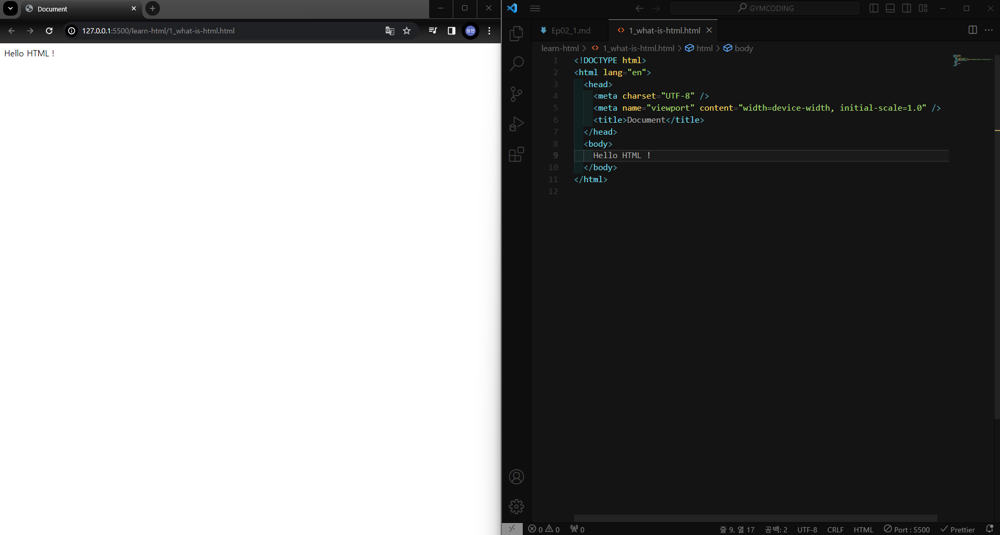
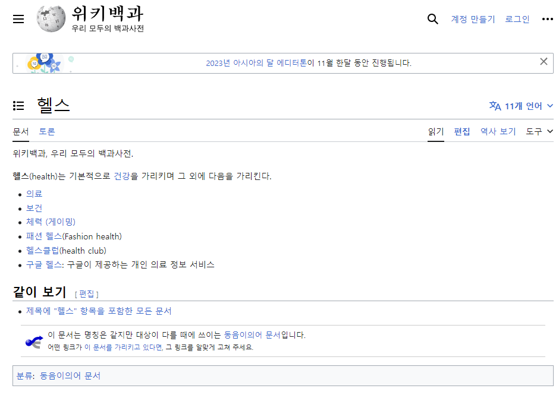
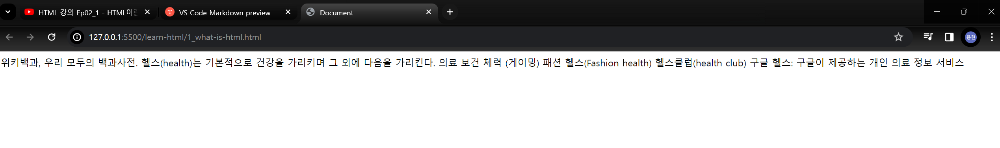
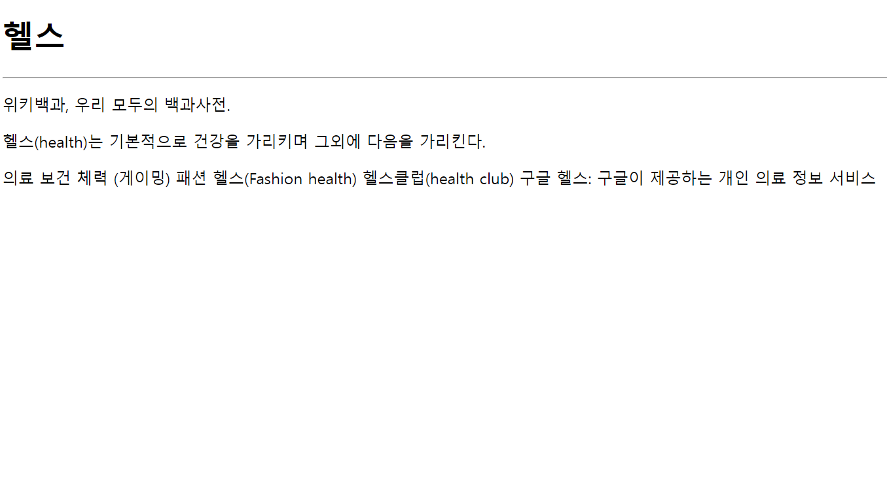
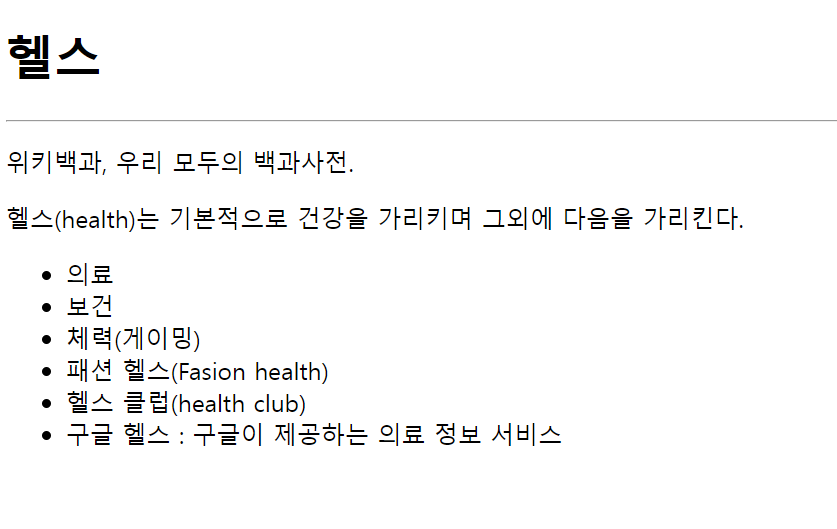
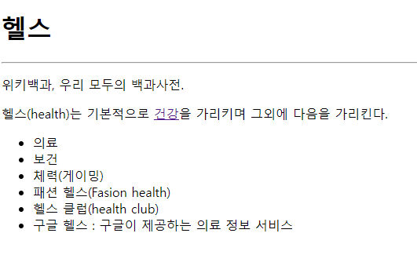
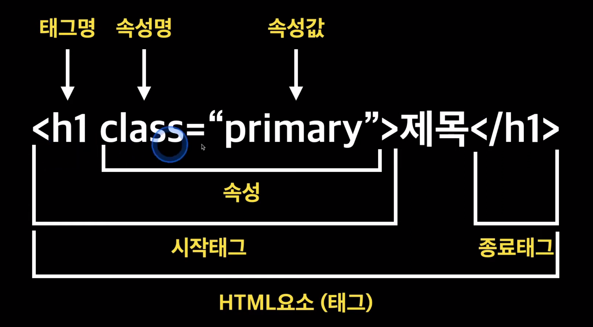

# HTML 이란

## HTML & CSS 입문

# 1. 먼저 만들어 보고 입문하자

{:width = '50%'}

- `! + tab` 을 이용하여 HTML 페이지를 만든 후 `live sever` 확장 프로그램을 이용하여 실시간으로 `html` 파일을 볼 수 있음
  </br>

### 1.1 만들어 볼 사이트

{:width = '50%'}

사용한 링크 : [헬스-위키백과](https://ko.wikipedia.org/wiki/%ED%97%AC%EC%8A%A4)
</br>

```html
<!DOCTYPE html>
<html lang="en">
  <head>
    <meta charset="UTF-8" />
    <meta name="viewport" content="width=device-width, initial-scale=1.0" />
    <title>Document</title>
  </head>
  <body>
    위키백과, 우리 모두의 백과사전. 헬스(health)는 기본적으로 건강을 가리키며 그
    외에 다음을 가리킨다. 의료 보건 체력 (게이밍) 패션 헬스(Fashion health)
    헬스클럽(health club) 구글 헬스: 구글이 제공하는 개인 의료 정보 서비스
  </body>
</html>
```

| {:width = '50%'} | {:width = '50%'} |
| ------------------------------------------------ | ---------------------------------------- |

- `<body></body>` tag 사이에 본문을 넣어서 페이지에 넣고자 하는 글을 넣을 수 있음
  - 하지만 위키백과의 모습과 다르게 줄글로 정렬된 형태를 보임
    </br>
    </br>

> # 수정해야 할 부분
>
> 1. 제목에 존재하는 **헬스** 글자는 본문보다 폰트가 커야함
> 2. **헬스** 밑에는 가로선이 존재함
> 3. 위키백과 , 우리 모두의 백과 사전 부터 ... 다음을 가리킨다 까지는 마킹이 필요함

```html
<!DOCTYPE html>
<html lang="en">
  <head>
    <meta charset="UTF-8" />
    <meta name="viewport" content="width=device-width, initial-scale=1.0" />
    <title>Document</title>
  </head>
  <body>
    <h1>헬스</h1>
    <hr />
    <p>위키백과, 우리 모두의 백과사전.</p>
    <p>헬스(health)는 기본적으로 건강을 가리키며 그외에 다음을 가리킨다.</p>
    의료 보건 체력 (게이밍) 패션 헬스(Fashion health) 헬스클럽(health club) 구글
    헬스: 구글이 제공하는 개인 의료 정보 서비스
  </body>
</html>
```

| {:width = '50%'} |  |
| ------------------------------------------------ | ------------------------ |

</br>

- `<h1><h1>` 태그를 이용하여 **헬스** 글자의 크기를 키워줬음
- `<p></p>` 태그를 이용하여 마킹
  - `<p>` 태그는 문단을 정의하는 태그로 HTML 에서는 텍스트를 구조화하고 문단을 나누기 위해 사용함
  - `<p>` tag로 감싼 텍스트는 브라우저에서는 보통 여백을 가진 단락으로 표시 됨
- `<hr />` 태그를 이용하여 가로선을 그어주었음
  </br>
  </br>

추가로 수정해야 할 부분들을 수정해보자
</br>
</br>

> # 수정해야 할 부분
>
> 1. 제목에 존재하는 **헬스** 글자는 본문보다 폰트가 커야함
> 2. **헬스** 밑에는 가로선이 존재함
> 3. 위키백과 , 우리 모두의 백과 사전 부터 ... 다음을 가리킨다 까지는 마킹이 필요함
>
> ---
>
> 4. 의료, 보건, 체력, 패션 헬스, 헬스클럽, 구글 헬스 등은 줄글이 아닌 목차로 표시해야 함
> 5. 파랗게 표시된 글자를 클릭하면 해당 문서로 이동하도록 만들어야 함

```html
<!DOCTYPE html>
<html lang="en">
  <head>
    <meta charset="UTF-8" />
    <meta name="viewport" content="width=device-width, initial-scale=1.0" />
    <title>Document</title>
  </head>
  <body>
    <h1>헬스</h1>
    <hr />
    <p>위키백과, 우리 모두의 백과사전.</p>
    <p>
      헬스(health)는 기본적으로
      <a href="https://ko.wikipedia.org/wiki/%EA%B1%B4%EA%B0%95">건강</a>을
      가리키며 그외에 다음을 가리킨다.
    </p>
    <ul>
      <li>의료</li>
      <li>보건</li>
      <li>체력(게이밍)</li>
      <li>패션 헬스(Fasion health)</li>
      <li>헬스 클럽(health club)</li>
      <li>구글 헬스 : 구글이 제공하는 의료 정보 서비스</li>
    </ul>
  </body>
</html>
```



```html
<ul>
  <li>글자</li>
</ul>
```



- `<ul> , <li>` tag 를 통해서 목차를 생성
- `<a href = 'url'>글자</a>` 를 통해서 하이퍼링크 형태로 생성

---

- HTML를 배운다는 것은 적재 적소에 사용할 tag 들을 외워 간다는 것을 의미

# 2. HTML 이란 무엇인가

**HTML** : Hyper Text Markup Language

- 기존의 문서들보다 Hyper 한 기능을 가지고 있는 문서를 의미
- 대표적으로 *HyperLink*나 _Markup_ 기능 등이 존재함

  - _HyperLink_ : 문서나 웹 페이지 내에서 다른 문서나 웹 페이지로 이동할 수 있도록 하는 링크를 의미
  - _Markup_ : 문서의 구조를 정의하고 표현하는 언어, HTML 에서는 태그를 사용하여 문서의 요소를 정의하고 이를 통해 텍스트의 구조, 이미지, 링크 등을 표현함

- HTML 은 태그로 이뤄진 Makrup 언어라고 정의 내릴 수 있음
  <br>
  <br>
  <br>
  

- 경우에 따라 종료태그가 존재하지 않는 태그도 존재함 (`<br>` , `hr /` .. 등)
- tag 안에는 class뿐이 아닌 id , 기타 등등 다양한 속성명과 속성값이 존재함
  <br>
  <br>

# 2.1 HTML 기본 문서 구조

```html
<!DOCTYPE html>
<html lang="en">
  <head>
    <meta charset="UTF-8" />
    <meta name="viewport" content="width=device-width, initial-scale=1.0" />
    <title>Document</title>
  </head>
  <body></body>
</html>
```

- 기본 문서 구조가 존재하는데 `!` + `enter` 만 해도 자동으로 기본 문서 구조가 호출됨
- `DOCTYPE` 은 어떤 버전으로 작성 되었는지를 설명
- `html lang = 'ko'`는 웹문서의 작성 언어가 무엇인지를 설명
- `'head'` 는 `html` 태그의 자식 태그이며 웹 페이지 내에서는 보이지 않음
- `body` 또한 `html` 태그의 자식 태그이며 웹 페이지 내에서 내용이 보여짐

# 2.2 HTML 주석

<br>

```html
<!--주석에 담을 내용을 적으세요-->
```

# 학습정리

- HTML이란 ?
  - Hyper Text Markup Language 약자이며 , 태그를 이용한 Markup 언어
- HTML Tag
  - Markup 기능을 담당하며 다양한 태그가 존재함
  - `<시작태그 속성명 = 속성값>글자<종료 태그>` 등으로 이뤄짐
- HTML 문서 기본 구조
  - Doctype : 어떤 마크업 언어로 작성 되었는지
  - html : 웹문서의 작성 언어가 무엇인지
  - head , body : html 태그의 자식 태그
- HTML 주석
  - `<!--내용-->` 과 같이 주석 처리함
