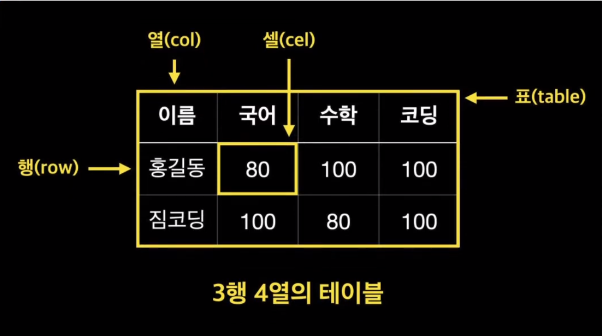
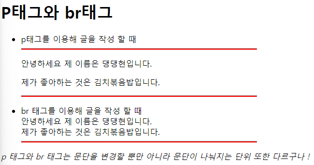
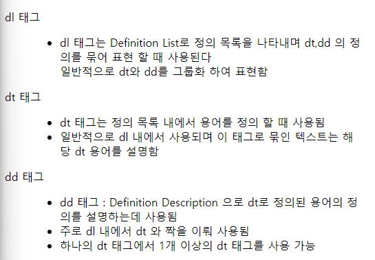
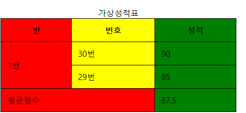

# HTML 태그

### HTML & CSS 입문

# 글꼴 태그

- `<h1>` ~ `h6` Heading
  웹 페이지의 _제목_ 또는 _부제목을 표현_ 할 대 사용하며, 숫자가 작을 수록 큰 제목을 표기하는데 사용함
  <br>

* `<p>` Paragraph
  하나의 `문단` 을 표현 할 때 사용함
  <br>
* `<br>` Break
  줄바꿈 태그로 HTML에서 개행 역할을 함 (종료 태그가 존재하지 않음)
  <br>
* `<hr>` Horizontal Rule
  `가로로 선`을 긋는 태그 (종료 태그 존재하지 않음)
  <br>
* `<i>` Italic
  텍스트를 <i>이텔릭체</i>로 표시할 때 사용함
  <br>

* `<em>` Emphasis
  텍스트를 <em>이텔릭체로 강조</em> 할 때 사용함
  <br>
* `<b>` Bold
  <b>텍스트를 진하게</b> 표시할 때 사용
* `<strong>`
  <strong>텍스트를 진하게 강조</strong>할 때 사용

<em> `<b> vs <strong>` , `<i> vs <em>` 차이</em>

> `<b>`,`<strong>` 모두 글자를 진하게 만들어주고 `<i>` , `<em>` 모두 글자를 이탤릭체로 만들어주는 것은 동일함
> 하지만 `<b>` 는 단순히 텍스트를 진하게만 만들고 `<i>` 는 단순히 텍스트를 이탤릭체로 만들어줌
> `<strong>` 태그와 `<em>` 태그는 **실제로 페이지 내의 중요한 부분으로 강조** 하고 싶을 때 사용
>
> - `<strong>` 태그는 스크린 리더를 사용 할시 실제로 해당 텍스트를 **거센 억양** 으로 음을 낼 수 있게 하며 실제 말할 때의 강조를 하듯 재구성 할 수가 있음
>   그러니 `<strong>` ,`<em>` 태그를 적절히 사용하면 **웹접근성** 에 큰 기여를 함

> - 웹 접근성
>
> 웹 접근성이란 모든 사람이 웹을 사용 할 수 있도록 보장하는 것을 의미, 즉 어떤 장애를 가진 사람들도 동등하게 웹을 이용하고 정보에 접근 할 수 있다는 개념
>
> 이는 웹사이트가 모든 사용자에게 적합하고 이해하기 쉽게 제작되어야 함을 의미함

# 목록 태그

- `<ol>` Ordered List
  **순서가 있는 목록** 을 표현할 때 사용함 . type 속성으로 글머리 기호를 변경할 수 있음
- `ul` Unordered List
  **순서가 없는 목록** 을 표현 할 때 사용
- `li` Listed item
  목록하위 항목으로 사용되며 , **`ul` 태그 혹은 `ol` 태그의 하위에 위치함**
- `dl` Definition List
  Definition List(정의목록)의 약자로, **사전처럼 용어를 설명하는 목록** 을 만듬
  예) A는B이다. 와 같은 key = value로 사용 할 때 유용
- `dt` Definition Term
  Definition Term(정의용어)의 약자로 **정의되는 용어의 제목** 을 넣을 때 사용
- `dd` Definition Description
  Definition Description(정의 설명)의 약자로 **용어를 설명** 하는데 사용

### 주의사항

- `<dl>` 태그는 하나 이상의 `<dt> - <dd>` 쌍의 태그를 갖고 있어야 한다.
  - 단 `<dt> - <dd>` 태그가 반드시 하나의 짝으로 지어져야 하는 것은 아니다.
- `<li>` , `<dt> - <dd>` **태그는 밖에서 독립적으로 사용 할 수 없다.**
- `<ul>` 태그 하위 요소로는 `<li>` 태그가 위치해야 한다.

> 정리하자면 `<li>` 태그는 `<ol> 이나 <ul>` 하위에 존재 해야 함
> `<dt> - <dd>` 태그는 `<dl>` 태그 하위에 존재 해야 함

<br>

# 표(table) 태그

### Table 구조



- `<table>` 태그 - 표
- `<tr>` 태그 - 행
- `<td>` 태그 - 열

### Table 기본 태그

- `<table>`
  표를 만드는 태그로서, **표 전체를 감싸는데 사용** 함
- `<caption>`
  **표의 제목이나 설명** 을 작성하는 태그
- `<tr>`
  **표의 행** 을 의미하는 태그, 자식으로 `<th>` 태그나 `<td>` 태그가 반드시 있어야 한다.
- `<th>`
  **표의 제목 열** 을 의미하는 태그, 부모 태그인 `<tr>` 태그 안에 있어야 한다.
- `<td>`
  **표의 일반 열** 을 의미하는 태그, 부모인 `<tr>` 태그 안에 있어야 한다.

### Table 그룹 관련 태그

- `<colgroup>`
  열을 그룹으로 묶을 수 있도록 해주는 태그
- `<col>`
  `<colgroup>`태그의 자식으로 열 단위를 나눌 수 있다. `span` 속성을 사용하여 열을 그룹으로 묶을지 설정한다.
  예) <col span="3"> → 세 개의 열을 그룹으로 묶음
- `<thead>`
  표의 제목 열들을 묶는 그룹 태그
- `<tbody>`
  표의 일반적인 데이터들을 묶는 그룹태그.
  기본적으로 행그룹태그를 사용하지 않으면 크롬브라우저가 자동으로 tbody 태그로 묶어줌.
- `<tfoot>`
  표의 하단 영역을 묶는 그룹태그

### Table 태그 관련 속성

- `<table>` 태그 속성
  - border - 테이블이 갖고 있는 테이블과 셀 모두 선을 표시한다. `웹표준X`
  - width - 테이블의 가로너비를 설정한다. `웹표준X`
  - cellpadding - 셀의 안쪽 여백으로써, 셀과 콘텐츠와의 간격을 조절함. `웹표준X`
  - cellspacing - 셀의 바깥쪽 여백으로써, 셀과 셀간의 간격을 조절함. `웹표준X`
    위 속성들은 XHTML 1.0에서는 웹 표준이지만 오늘날 **HTML5에서는 웹 표준이 아닙니다. → CSS로 대체해야 함.**
- `<th>` 태그 속성
  - scope - 웹접근성 관련 속성으로 스크린리더가 데이터를 인식하고 읽는 순서를 결정짓게 합니다.
    - th가 열에 쓰일경우 값을 "col"로 설정합니다. 예) `<th scope="col">`
    - th가 행에 쓰일경우 값은 "row"로 설정합니다. 예) `<th scope="row">`
- `<th>`, `<td>`
  - colspan - 열을 병합하는 속성. 예) `<td colspan="2">`
  - rowspan - 행을 병합하는 속성. 예) `<td rowspan="2">`
- `<col>`
  - width - 열의 가로너비를 지정하지만 `웹표준X` → CSS로 대체
  - span - 열을 그룹화 함. 예) <col span="3"> → 세 개의 열을 묶음.

# 추가 공부

### `<p>` 태그는 왜 써야 하는거야 ? `<br>` 태그로 구조를 나누면 안돼 ?



> - p 태그는 문단을 구분 짓는데 사용됨
> - 단락을 나누는 것 뿐 아니라 **문단의 의미구조** 를 나타내며 검색 엔진이나 웹 페이지의 구조를 파악하는데 도움이 된다.
> - br 태그는 줄바꿈 요소를 삽입 할 때 사용되지만 **단락의 의미** 를 전달하지는 않음
>
> * p 태그를 통해 **문단** 이라는 의미적 단위를 만들어 내어 가독성을 높이고 문서 구조를 명확히 함
>
> - 이를 통해 시각적 효과뿐 아니라 웹 페이지의 의미 구조를 확립하여 웹 접근성과 SEO(검색 엔진 최적화)에 도움을 줄 수 있음

##### 문단 구조를 잘 나누는 것이 검색 엔진 최적화에 도움이 되는 이유

> - 의미적 구분: p 태그를 사용하여 문단을 나누면 각각의 p 태그는 독립적인 의미 단위로 해석됨. <br/> 검색 엔진은 이러한 구분을 통해 각각의 문단이 어떤 내용을 담고 있는지 파악할 수 있음.
>
> - 가독성: 문단은 의미적인 단위로 정보를 구성하므로, 사용자들이 정보를 빠르게 찾고 이해할 수 있도록 도와줌. <br> 이는 사용자 경험에 긍정적인 영향을 미치며, 검색 엔진은 사용자들이 원하는 정보를 빠르게 찾을 수 있는 페이지를 선호함.
>
> - 키워드 및 콘텐츠 이해: 검색 엔진은 문단을 통해 특정 키워드나 콘텐츠의 주제를 파악할 수 있음. 이는 검색 결과의 정확도를 높여주고, 사용자가 검색했을 때 그에 맞는 페이지를 노출시킬 수 있도록 도와줌.

### <b>dl, dd, dt 태그가 헷갈린다</b>



```html
<dl>
  <dt>dl 태그</dt>
  <dd>
    <ul>
      <li>
        dl 태그는 Definition List로 정의 목록을 나타내며 dt,dd 의 정의를 묶어
        표현 할 때 사용된다 <br />
        일반적으로 dt와 dd를 그룹화 하여 표현함
      </li>
      <!-- 다른 설명 -->
    </ul>
  </dd>
  <dt>dt 태그</dt>
  <dd>
    <ul>
      <li>dt 태그는 정의 목록 내에서 용어를 정의 할 때 사용됨</li>
      <li>
        일반적으로 dl 내에서 사용되며 이 태그로 묶인 텍스트는 해당 dt 용어를
        설명함
      </li>
      <!-- 다른 설명 -->
    </ul>
  </dd>
  <dt>dd 태그</dt>
  <dd>
    <ul>
      <li>
        dd 태그 : Definition Description 으로 dt로 정의된 용어의 정의를
        설명하는데 사용됨
      </li>
      <li>주로 dl 내에서 dt 와 짝을 이뤄 사용됨</li>
      <li>하나의 dt 태그에서 1개 이상의 dt 태그를 사용 가능</li>
      <!-- 다른 설명 -->
    </ul>
  </dd>
</dl>
```

> 몰랐는데 dt 태그 안에서 블록 수준의 태그를 직접 포함할 수 없다고 한다.
> (블록 수준의 태그란 h1,h2 .. 등이나 p , ul , ol 태그등을 의미함)
> `<dt>`태그는 그 자체로 용어를 정의하기 위한 태그이며 제목 등의 스타일을 적용 하고 싶다면 `<dt>`에 직접 스타일을 적용하거나 CSS를 사용하여 스타일을 변경해야 한다고 한다.
> HTML 명세서에 따르면 `<dt>`에는 블록 수준의 태그를 직접 사용해서는 안된다.

### Table 구조 복습하기

##### table의 기본 구조

```html
<table>
  <caption>
    테이블 이름
  </caption>
  <!-- tr 은 행을 이야기 -->
  <tr>
    <th>첫 번째 행에 들어갈 열들</th>
  </tr>
  ...
</table>
```

기본 구조는 다음과 같으며 `<tr></tr>` 안에 열을 의미하는 `<th></th>` 나 `<td></td>` 로 셀들을 채워나가면 된다.

- 이 때 `<th>` 태그는 제목을 지정하는 열을 의미
- `<td>` 태그는 내용을 지정하는 열들을 의미함

### table 에 선 긋기

- 기본적으로 HTML의 테이블 요소에는 테두리가 없는 스타일이 적용됨
  - 테이블에 테두리를 추가하려면 CSS를 사용하여 bordoer 속성을 지정해야 함
  ```html
  <style>
    th,
    td {
      border: 1px solid black;
    }
    table {
      border: 1px solid black;
      border-collapse: collapse;
    }
  </style>
  ```
  - `th,td` 태그에는 border라인을 지정하고 `table` 에도 border 를 지정해줌
  - `table`의 스타일 태그에서 `border-collapse : collapse` 를 지정해주는 이유는 겹쳐지는 테두리에 대해서 어떻게 합쳐지는지를 지정함
    - `collapse` : 테이블의 경계를 합쳐 단일 경계로 만듦
    - `separate` : 테이블의 경계를 개별적으로 표시함

### table에서 `thead`, `tbody` , `tfoot` 은 왜 설정해 ?

- `thead` : 테이블의 헤더 부분을 나타내며 표의 제목이나 행이나 열이 들어가며 테이블의 맨 위쪽에 위치함
- `tbody` : 테이블의 본문을 나타내며 실제로 표시될 데이터들이 `tbody`에 포함됨 , 주로 여러 행이 들어가며 표의 주된 내용이 이 부분에 위치함
- `tfoot` : 테이블의 바닥글(푸터) 부분을 나타냄, 주로 표의 하단에 위치하며 표의 요약 정보나 바닥글 내용이 들어감
  - 통계적 데이터나 기타 요약 정보를 보여주는데 사용됨

> thead , tbody , tfoot 으로 구조적으로 나누는 이유
> 테이블의 구조를 나누고 시맨틱하게 표현함으로써 사용자가 테이블의 각 부분이 무엇을 의미하는지 명확히 파악할 수 있도록 도와준다.
> 특히 웹 접근성 입장에서도 장점이 있다.

> 웹 접근성말고도 CSS 나 JavaScript 를 활용하는 이점이 존재한다.
>
> CSS를 활용하는 이점
>
> - 스타일링 용이성 : 각 부분에 대한 스타일을 구분하여 적용 할 수 있다. 예를 들어 thead 로 구분된 영역에만 색상, 글꼴, 형태 등을 다른 부분과 구분하여 스타일링 할 수 있다.
>
> JavaScript 를 활용하는 이점
>
> - 동적 조작 : 테이블의 각 부분을 동적으로 조작하거나 데이터를 추가/제거 할 수 있다. 예를 들어 새로운 행을 동적으로 추가하거나, 행을 정렬하거나 필터링 하는등의 작업을 수행 할 수 있다.
> - 접근성 향상 : JavaScript 를 사용하여 테이블을 동적으로 조작 할 때 스크린 리더와 같은 보조기기를 사용하는 사용자들의 접근성을 향상 시킬 수 있다.

### table에서 colgroup 은 왜 설정하지 ?

```html
<style>
  .col1 {
    background-color: red;
  }
  .col2 {
    background-color: yellow;
  }
  .col3 {
    background-color: green;
  }
</style>
...

<colgroup>
  <col class="col1" />
  <col class="col2" />
  <col class="col3" />
</colgroup>
```



- table 에서 `colgroup` 을 설정하여 각 열마다 `class` 를 지정해주는 모습을 볼 수 있음

- `colgroup` 은 `table` 의 `열` 들을 그룹화 하는데 사용되며 이것을 사용하는 이유는 열들에 동일한 스 타일이나 속성을 적용하기 위함
- 또한 `colgroup` 을 사용하면 열들에 대한 쉬운 관리와 구조화를 할 수 있으며 스타일을 적용하거나 `JavaScript`를 통해 특정 열 그룹을 조작하기 쉬워짐

### 테이블의 너비는 어떻게 지정하는데 ?

```html
<style>
  table {
    border: 1px solid black;
    border-collapse: collapse;
    width: 50%;
  }
  th,
  td {
    border: 1px solid black;
    padding: 12px;
  }
</style>
```

> ### width 와 padding 의 차이
>
> - width : 테이블이나 셀의 너비를 지정하는 속성
>   - 테이블의 전체적인 너비를 조절함
> - padding : 셀 내부의 콘텐츠와 테두리 사이의 간격을 지정하는 속성
>   - 셀 내의 콘텐츠와 테두리간의 여백이 발생함

### `rowspan` 과 `colspan`

```html
<table border="1">
  <tr>
    <td rowspan="n">셀 1</td>
    <td>셀 2</td>
  </tr>
  <tr>
    <td>셀 3</td>
  </tr>
</table>
```

- `rowspan` : 여러 행을 걸쳐 병합하는데 사용됨 , 해당 셀이 자신의 위치로부터 아래쪽으로 n개의 행을 차지하도록 설정됨

```html
<table border="1">
  <tr>
    <td colspan="n">셀 1</td>
    <td>셀 2</td>
  </tr>
</table>
```

- `colspan` : 여러 열을 걸쳐 병합하는데 사용됨 , 해당 셀이 자신의 위치로부터 오른쪽으로 n 개의 열을 차지하도록 설정됨
