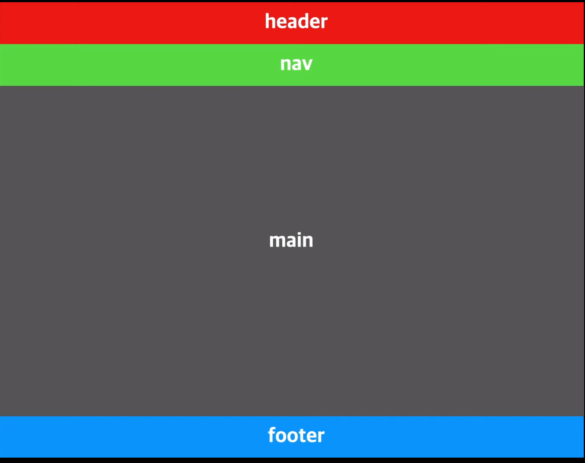
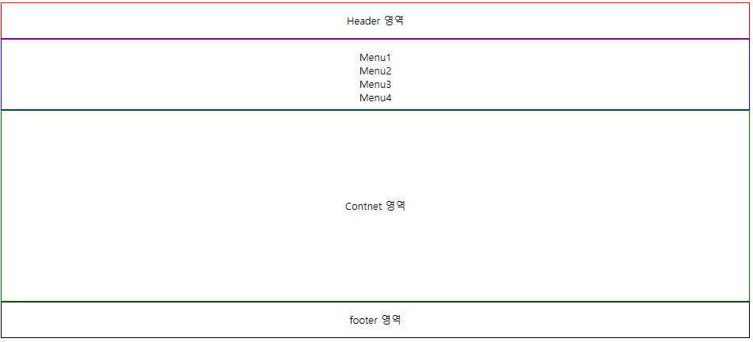
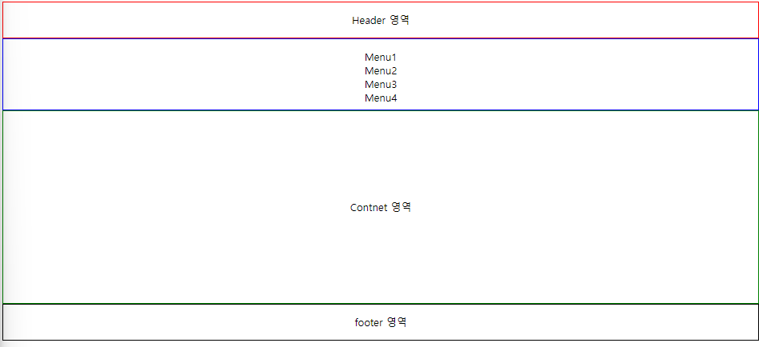
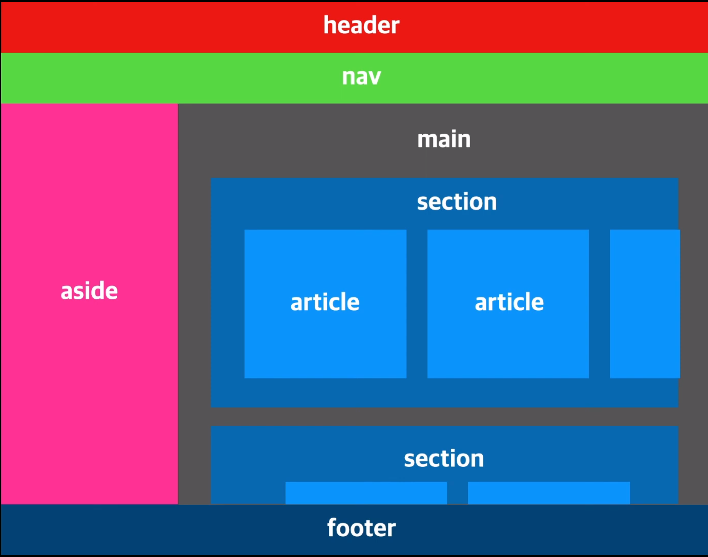
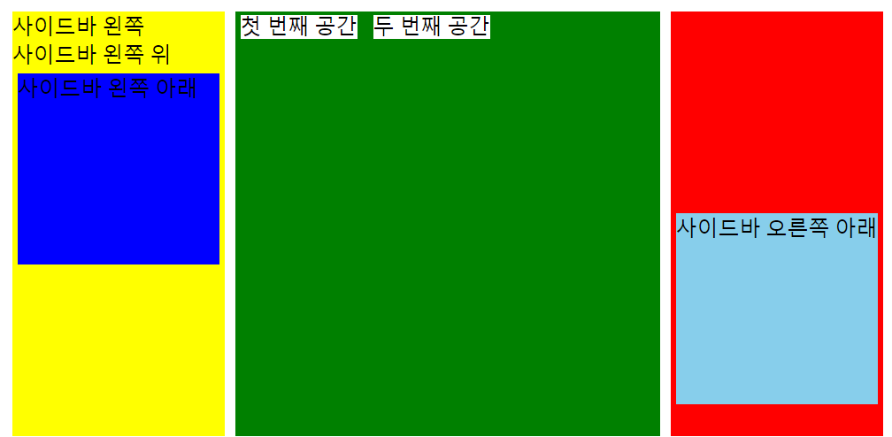

# Semantin 태그

# 사전적 의미

- Semantic : 의미론적 의미를 갖는 태그

# Semantic 태그의 이점

- 검색엔진 최적화
- 웹 접근성 향상
  - 화면 낭독기가 semantic 태그에 따라 다르게 읽음에 따라 `웹 접근성` 향상
- 가독성 향상

# 대표적 Semantic 태그

- `<header>` : 페이지에 대한 정보를 담는 태그로, 페이지 상단에 위치
- `<nav>` : 다른 페이지나 같은 페이지 안에 다른 부분으로 이어주는 네비게이션 링크로 구성된 섹션을 표현
- `<aside>` : 페이지 전체 내용과는 어느정도 관련성이 있지만, 주요 내용과는 직접적인 연관성은 없는 분리된 내용을 담고 있음
- `<main>` : 문서의 body 요소의 주 콘텐츠(main content)를 정의할 때 사용함
- `<section>` : 문서나 응용프로그램의 일반적인 섹션을 표현함
- `<article>` : 여러가지 이에팀들을 묶어 재사용 가능하게 그룹화함
- `<details>` : 추가적인 정보를 나타내거나 사용자가 요청하는 정보를 나타냄
- `<summary>` : 부모요소인 `<details>` 요소의 내용에 대한 요약이나 캡션 등을 나타냄
- `<figure>` : 일러스트, 다이어그램, 사진, 코드등에 주석을 다는 용도로 사용됨
- `<figcaption>` : 부모요소인 `<figure>`요소의 내용들에 대한 캡션, 혹은 제목을 나타냄
- `<mark>` : 하나의 문서 내에서 다른 문맥과 관련성을 나타내기 위한 참조 목적으로 마킹되거나 하이라이트된 텍스트를 표현함
- `<time>` : 24시간내에서의 시간 혹은 그레고리력에서의 정밀한 날짜를 나타냄

> 억지로 외우려기 하기보다는 웹사이트를 만들다보면 자연스럽게 익히게 될 것임



페이지의 레이아웃을 semantic 태그를 이용하여 구성 할 수 있음

예전에는 semantic 태그를 이용하기 보다 `<div>` 태그를 이용하여 클래스를 부여한 후 사용하곤 했는데 차이를 실습해보자

# Non Semantic tag



```html
<!DOCTYPE html>
<html lang="en">
  <head>
    <meta charset="UTF-8" />
    <meta name="viewport" content="width=device-width, initial-scale=1.0" />
    <title>Non Semantic</title>
    <style>
      * {
        text-align: center;
      }
      ul {
        list-style: none;
        padding-left: 0px;
      }
      .header {
        border: 2px solid red;
        line-height: 55px;
        height: 55px;
      }
      .nav {
        border: 2px solid blue;
        height: 110px;
      }
      .main {
        border: 2px solid green;
        height: 300px;
        line-height: 300px;
      }
      .footer {
        border: 2px solid black;
        height: 55px;
        line-height: 55px;
      }
    </style>
  </head>
  <body>
    <div class="header">Header 영역</div>
    <div class="nav">
      <ul>
        <li>Menu1</li>
        <li>Menu2</li>
        <li>Menu3</li>
        <li>Menu4</li>
      </ul>
    </div>
    <div class="main">Content 영역</div>
    <div class="footer">Footer 영역</div>
  </body>
</html>
```

# Semantic tag



```html
<!DOCTYPE html>
<html lang="en">
  <head>
    <meta charset="UTF-8" />
    <meta name="viewport" content="width=device-width, initial-scale=1.0" />
    <title>Semantic</title>
    <style>
      * {
        text-align: center;
      }
      header {
        border: 2px solid red;
        line-height: 55px;
        height: 55px;
      }
      nav {
        border: 2px solid blue;
        height: 110px;
      }
      ul {
        list-style: none;
        padding-left: 0px;
      }
      main {
        border: 2px solid green;
        height: 300px;
        line-height: 300px;
      }
      footer {
        border: 2px solid black;
        height: 55px;
        line-height: 55px;
      }
    </style>
  </head>
  <body>
    <header>Header 영역</header>
    <nav>
      <ul>
        <li>Menu1</li>
        <li>Menu2</li>
        <li>Menu3</li>
        <li>Menu4</li>
      </ul>
    </nav>
    <main>Contnet 영역</main>
    <footer>footer 영역</footer>
  </body>
</html>
```

`<div>` 태그를 사용하여 class 를 지정해주었을 때 보다 코드의 가독성이 간결하다.



페이지 레이아웃은 아까처럼 단순하지 않고 다양한 형태로 표현이 가능하다.

예를들어 `<section>` 태그는 일반적으로 페이지의 영역을 나눌 때 사용
`<article>` 여러 그룹들을 그룹핑 하여 재사용할 수 있게 만드는 태그


예를 들어 온라인 쇼핑몰에서 class가 지정된 태그들을 `article` 태그를 이용하여

여러 목록들을 가져오는 등의 역할을 할 수 있다.

HTML에서 문서를 마크업 할 때는 시맨틱 태그를 이용하여 의미를 적절하게 담아 사용해야 한다.

# 추가 공부

# `<div>` 태그 , `<span>` 태그가 뭐지 ?

### `<div>` 태그

div 태그는 Division의 약자로 레이아웃을 나누는데 주로 쓰인다.
다른 태그와 다르게 `특별한 기능을 갖고 있지는 않고, 가상의 레이아웃`을 설계하는데 쓰이며,
주로 `CSS와 연동`하여 쓰인다.

<style>
dt {
font-size: 50px;
font-family: 'Franklin Gothic Medium', 'Arial Narrow', Arial, sans-serif;
}
dd {
font-size: 20px;
font-family: 'Franklin Gothic Medium', 'Arial Narrow', Arial, sans-serif;
}
table {
border: 1px solid black;
border-collapse: collapse;
width: 800px;
text-align: center;
margin: 0 auto; /_ margin : 0 auto 는 테이블을 수평으로 가운데 정렬 _/
}
th,
td {
border: 1px solid black;
padding: 12px;
}
th {
background-color: orangered;
color: white;
}
caption {
border: 1px solid black;
border-bottom: none;
background-color: orangered;
color: white;
}
.codeblock {
background-color: #f5f5f5;
border: 1px solid #ccc;
border-radius: 5px;
padding: 10px;
margin-bottom: 15px;
font-family: 'Courier New', Courier, monospace;
line-height: 1.5;
overflow: auto;
}

      .listup {
        background-color: rgb(91, 95, 95);
        border: 1px solid rgb(137, 140, 140);
        width: 80%;
        padding: 10px;
        overflow: auto;
        color: white;
        margin: auto;
      }

      div#side_left {
        width: 200px;
        height: 400px;
        background-color: yellow;
        float: left;
        margin: 5px;
      }
      #side_left_box {
        width: 95%;
        height: 45%;
        background-color: blue;
        float: left;
        margin: 5px;
      }
      #mid_content {
        width: 400px;
        height: 400px;
        background-color: green;
        float: left;
        margin: 5px;
      }
      #side_content_box {
        display: inline;
        background-color: white;
        margin: 5px;
      }
      #side_right {
        width: 200px;
        height: 400px;
        background-color: red;
        float: left;
        margin: 5px;
      }
      #side_right_box {
        width: 95%;
        height: 45%;
        background-color: skyblue;
        margin: 5px;
        margin-top: 95%;
      }
    </style>

  <body>
    <dl>
      <dt>div tag</dt>
      <br />
      <dd>
        div 태그란 division tag의 약자로
        <strong
          >다른 태그와 다르게 특별한 기능을 갖고 있지는 않고<br />
          가상의 레이아웃</strong
        >을 설계하는데 쓰이며, 주로 CSS와 연동하여 쓰인다.
        <br />
        <h3>사용 예시</h3>
        <div style="background-color: cyan">구역1</div>
        <div style="width: 100px; height: 100px; background-color: yellow">
          구역2
        </div>
        <br />
        <div class="codeblock">
          <code>
            <pre>
            &lt;div style="background-color: cyan"&gt;구역1&lt;/div&gt;
            &lt;div style="width: 100px; height: 100px; background-color: yellow"&gt;구역2&lt;/div&gt;
          </pre
            >
          </code>
        </div>
        <table>
          <caption>
            div 태그 사용법 & 예제
          </caption>
          <thead>
            <tr>
              <th>태그</th>
              <th>속성</th>
              <th>비고</th>
            </tr>
          </thead>
          <tbody>
            <tr>
              <td rowspan="7">div</td>
              <td>style</td>
              <td>스타일</td>
            </tr>
            <tr>
              <td>width</td>
              <td>가로 크기</td>
            </tr>
            <tr>
              <td>height</td>
              <td>세로 크기</td>
            </tr>
            <tr>
              <td>border</td>
              <td>테두리 굵기</td>
            </tr>
            <tr>
              <td>background-color</td>
              <td>배경 색상</td>
            </tr>
            <tr>
              <td>float</td>
              <td>정렬</td>
            </tr>
            <tr>
              <td>margin</td>
              <td>여백</td>
            </tr>
          </tbody>
        </table>
        <br />
        <div class="listup">
          <ol>
            <li>
              style은 div 태그의 스타일을 지정해주는 것으로 다른 속성들을 사용
              할 수 있게끔 해준다.
            </li>
            <li>
              width 는 div의 가로크기를 정해준다. 픽셀(px) 단위로도 정해줄 수
              있고 %(비율) 단위로 정할 수 있다.
            </li>
            <li>
              height는 div의 세로크기를 정해준다. width와 같이 px , % 단위로
              정할 수 있다.
            </li>
            <li>
              border는 div의 테두리의 굵기를 정해주며 숫자가 클 수록 굵기가
              굵어진다.
            </li>
            <li>background-color는 div 태그의 배경 색상을 정하는 속성이다</li>
            <li>
              flot은 div의 정렬(좌,우)을 하는 속성이다.가운데 정렬은 안된다.
            </li>
            <li>
              margin 은 div의 정렬 기준 끝에서부터 여백을 주는 속성이다.
              <br />(margin-top, margin-bottom)
            </li>
          </ol>
        </div>
        <br />
        <p>
          코드 블록과 리스트를 담는 것들도 div 태그 안에 넣어서 구역 안에서
          이쁘게 정리 할 수 있다.
        </p>
        <br />
        <p>
          지금은 간단하게 블록만 나눠봤지만 실제 페이지 레이아웃처럼 블록을
          나눠보자
        </p>
        <br />

```html
<style>

      div#side_left {
        width: 200px;
        height: 400px;
        background-color: yellow;
        float: left;
        margin: 5px;
      }
      #side_left_box {
        width: 95%;
        height: 45%;
        background-color: blue;
        float: left;
        margin: 5px;
      }
      #mid_content {
        width: 400px;
        height: 400px;
        background-color: green;
        float: left;
        margin: 5px;
      }
      #side_content_box {
        display: inline;
        background-color: white;
        margin: 5px;
      }
      #side_right {
        width: 200px;
        height: 400px;
        background-color: red;
        float: left;
        margin: 5px;
      }
      #side_right_box {
        width: 95%;
        height: 45%;
        background-color: skyblue;
        margin: 5px;
        margin-top: 95%;
      }
    </style>
    ....

        <div id="side_left">
          사이드바 왼쪽
          <div id="side_left_bottom">사이드바 왼쪽 위</div>
          <div id="side_left_box">사이드바 왼쪽 아래</div>
        </div>

        <div id="mid_content">
          <div id="side_content_box">첫 번째 공간</div>
          <div id="side_content_box">두 번째 공간</div>
        </div>

        <div id="side_right">
          <div id="side_right_box">사이드바 오른쪽 아래</div>
        </div>
      </dd>
    </dl>
```



  </body>
