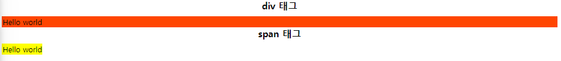

# Inline vs Block

Inline Level Element vs Block Level Element

`css` 와 겹치는 내용이기에 `css` 에서 한 번 더 설명하기로 함

# div , span

두 태그 모두 웹 페이지의 영역을 구분하는 태그

둘 다 특별한 의미를 가지는 semantic 태그는 아니다.

### div 태그

<ul>
<li>대부분 시각적인 HTML 레이아웃을 나누기 위해 사용됨</li>
<li><strong>블록 레벨 요소</strong>로, 한 줄을 다 차지하는 형태를 가짐</li>
<li>대개 레이아웃의 영역을 나누거나 그룹화하는데 사용됨</li>
<li>보통 <strong>CSS</strong>를 통해 스타일을 적용하거나, 여백, 폭, 높이 등을 조절하는데 주로 활용됨</li>
 </ul>

### span 태그

<ul>
<li>텍스트나 텍스트 일부분을 스타일링 하기 위해 사용됨</li>
<li><strong>인라인 요소</strong>로 컨텐츠의 일부분만을 감쌈</li>
<li>특정 부분에 스타일을 적용할 때 사용됨, <strong>텍스트 강조나 특정 부분의 스타일링에 활용됨</strong></li>
</ul>

실제로 코드를 통해 `<div>` 태그와 `<span>` 태그를 비교해보자


# 결과물로 보는 div , span 태그의 차이

```html
<!DOCTYPE html>
<html lang="en">
  <head>
    <meta charset="UTF-8" />
    <meta name="viewport" content="width=device-width, initial-scale=1.0" />
    <title>Inline block</title>
    <style>
      header {
        font-size: 20px;
        font-weight: bold;
        text-align: center;
        margin-bottom: 10px;
      }
      div {
        background-color: orangered;
        border: 1px solid orangered;
      }
      span {
        background-color: yellow;
        border: 1px solid yellow;
      }
    </style>
  </head>
  <body>
    <header>div 태그</header>
    <main>
      <div>Hello world</div>
    </main>
    <header>span 태그</header>
    <main>
      <span>Hello world</span>
    </main>
  </body>
</html>
```

<br />


`<div>` 태그는 **문구가 있는 영역** 에 대한 스타일링이 가능하고
`<span>` 태그는 **문구** 에 대한 스타일링이 가능한 모습을 볼 수 있다.


<strong>HTML 태그들은 쓰임에 따라 default display 값을 갖는다.</strong>
초기 디스 플레이 값이 block 인지, inline 인지에 따라 `block level 요소` , `inline level 요소`인지를 따른다.


`<div>` 태그의 Computed 값을 보면 `display : block` 으로 되어 있는 모습을 볼 수 있다.

`<span>` 태그는 `display : inline` 으로 되어 있는 모습을 볼 수 있다.

<h1> Block Element vs Inline Element</h1>

<h3>Block Element</h3>

블록 레벨 요소는 부모 요소의 **전체 공간** 을 차지하여 `블록`을 만든다.
`<h1>~<h6>` , `<ol>` , `<ul>` , `<li>`,`<p>` 태그 등이 블록 요소에 속한다.

- 화면 구성이나 레이아웃을 짤 때는 블록 레벨 요소를 사용한다.
- 블록 레벨 요소는 한 칸을 모두 차지하기 때문에 세로로 나열된다.
- width , height, margin 속성이 적용됨

### Inline element

인라인 레벨 요소는 콘텐츠의 흐름을 끊지 않고 (줄바꿈 X), 요소를 구성하는 <strong>태그에 할당된 공간만 차지</strong>한다.
`<a>`,`<em>`,``,`<span>` 태그 등이 인라인 요소에 속한다.

- 인라인 레벨 요소는 콘텐츠의 영역 만큼 차지하기 때문에 가로로 나열된다.
- margin-top , margin-bottom이 적용되지 않는다.대신 line-height 이용
- weight, height 속성이 적용되지 않는다.
- 태그가 콘텐츠의 할당 된 공간만 갖고 있기 때문에 text-align과 같은 속성은 사용 할 수 없다.


```html
<!DOCTYPE html>
<html lang="en">
  <head>
    <meta charset="UTF-8" />
    <meta name="viewport" content="width=device-width, initial-scale=1.0" />
    <title>inline block_2</title>
    <style>
      div {
        background-color: orangered;
        width: 100px;
        height: 100px;
        border: 1px solid blue;
      }
      span {
        background-color: yellow;
        width: 100px;
        height: 100px;
        border: 1px solid blue;
      }
    </style>
  </head>
  <body>
    <div>1</div>
    <div>2</div>
    <div>3</div>

    <span>1</span>
    <span>2</span>
    <span>3</span>
  </body>
</html>
```

> 1. div 태그는 콘텐츠가 들어있는 영역에 대해서 width , height 를 조절할 수 있는 모습을 볼 수 있음
> 2. span 태그는 콘텐츠에 대해서 스타일링 할 수 있기 때문에 width, height를 조절 할 수 없는 모습을 볼 수 있음
> 3. div 태그는 block element 이기 때문에 차곡 차곡 세로로 쌓이는 모습을 볼 수 있음 (줄바꿈 O)
> 4. span 태그는 inline element 이기 때문에 줄바꿈이 없이 쌓이는 모습을 볼 수 있음

### CSS Display 속성 

- `none` : 보이지 않음
- `block` : block 요소로 표시
- `inline` : inline 요소로 표시
- `inline-block` : block 과 inline의 중간 형태로 요소는 inline인데 내부는 block 처럼 표시함
- `flex` : Layout을 만들 때 자주 사용하는 값으로 뒤에서 자세히 다룰 예정 
... 
