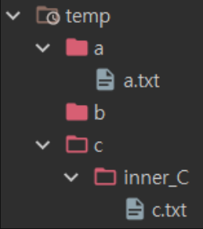

# 이미지 태그

`` 태그는 HTML 문서에 이미지를 넣는다.

```html

```

### 속성

- `src` : 필수이며 **이미지의 경로** 를 지정
- `alt` : 이미지의 텍스트 설명이며 필수는 아니지만 스크린 리더가 `alt`의 값을 읽어 사용자에게 이미지를 설명하므로, 웹 접근성 차원에서 **매우 유용** . 또한 네트워크 오류, 콘텐츠 차단, 죽은 링크 등 이미지를 표시할 수 없는 경우에도 이 속성의 값을 대신 보여줌
- `height` : 픽셀 단위의 이미지 고유 크기. 단위 없는 정수여야 함
- `width` : 픽셀 기준 고유 너비. 단위 없는 정수여야 함


```html
<!DOCTYPE html>
<html lang="en">
  <head>
    <meta charset="UTF-8" />
    <meta
      name="viewport"
      content="width=
  , initial-scale=1.0"
    />
    <title>img</title>
  </head>
  <body>
    <h2>이미지 태그</h2>
    
  </body>
</html>
```

현재 삽입할 `img.jpg` 는 작업중인 `html` 파일 폴더에 존재하니 `.../이미지이름.확장자` 로 불어올 수 있다.

만약 이미지 경로에 문제가 생겼을 경우에 `alt` 에 지정한 텍스트가 나오는 모습을 볼 수 있다.
``


# 절대 경로 vs 상대 경로

### 절대 경로

리소스(이미지)의 절대경로는 말 그대로 절대적인 고유한 경로를 지정하는 것

- 웹 이미지의 절대 경로 : http 프로토콜로 시작해서 전체 경로를 입력함
  - 예 : `http//www.naver.com/이미지명.확장자`
- 웹 이미지의 절대 경로 : /이미지명.확장자
  - 루트('/') 디렉터리부터 시작하는 경우 현재 도메인이 자동으로 앞에 붙음
    예 : `/이미지명.확장자`
  - > 루트 디렉토리 : 폴더의 최상위 디렉토리를 루트 디렉토리라고 한다.
- PC 컴퓨터 절대 경로 : -`C:\user\폴더명\이미지명.확장자`

절대 경로를 이용하면 **웹에서 이미지가 사라지거나 내 컴퓨터에서 만든 파일을 다른 곳으로 옮길 때 해당 절대 경로를 다시 수정해야 하는 불편함** 이 존재함

### 상대 경로

상대 경로는 현재 문서를 기준으로 경로를 인식하는 방법

- `index.html` 에서 동일한 위치에 있는 `이미지명.확장자` 를 가져오는 방법 -> `src = '이미지명.확장자'` 또는 `src = "./이미지명.확장자`
- `index.html` 의 상위 폴더에 이미지가 있는 경우 -> `src = '../이미지명.확장자'`
  - `../` 는 상위 폴더로 접근하는 언어로서 만약 상위 폴더가 두 겹일 경우에는 `../..` 을 통해 접근 가능
- `index.html` 의 하위 폴더에 이미지가 있는 경우 -> `src = '하위폴더/이미지명.확장자'`


```html
<!DOCTYPE html>
<html lang="en">
  <head>
    <meta charset="UTF-8" />
    <meta
      name="viewport"
      content="width=
  , initial-scale=1.0"
    />
    <title>img</title>
  </head>
  <body>
    <h2>이미지 태그</h2>
    
    <h3>이미지 크기 변경</h3>
    <p>이미지의 크기를 `width = "200"` 으로 지정해보자</p>
    
    <h3>하위 폴더에 위치한 이미지 가져오기</h3>
    <p>
      현재 html 파일이 존재하는 문서 안 하위폴더인 img 폴더 안에 이미지가
      들어있기 때문에 <br />
      'src = "/img / img_2.png"' 로 설정
    </p>
    
  </body>
</html>
```

### 절대 경로 vs 상대 경로 추가 공부

### 절대경로

##### 정의

- 파일의 `root` 부터 해당 파일까지의 전체 경로 (url) 을 의미한다. 절대 경로는 보통 다른 사람의 문서나 파일을 이용할 때 사용한다.
- 절대 경로는 어느 곳에서든 경로에 접근 할 수 있는 장점이 존재
- 그러나 경로가 변경되면 경로를 일일히 수정해야 한다는 단점이 존재한다.

> ##### 절대 경로의 예시
>
> https://url 주소/이미지명.확장자
> C:\program files\폴더명 ..
> 만약 내 컴퓨터 안에 이미지 라는 폴더 내부에 img.jpg 를 넣었을 때 img.jpg 의 절대 경로는
> C:\이미지\img.jpg 가 된다.

**절대 경로는 파일이나 폴더가 컴퓨터의 최상위 루트 디렉토리부터 전체 경로를 나타내는 것**

### 상대 경로

##### 정의

- 상대 경로는 현재 파일의 위치를 기준으로 연결하려는 파일의 상대적인 경로를 적는 것을 의미함
- 상대 경로는 주소나 프로젝트 디렉토리의 위치가 바뀌어도 내부 구조만 그대로라면 수정 없이 그대로 사용 할 수 있다는 장점을 가지고 있음
- 그러나 자기 자신이 기준이기 때문에 자기 자신의 위치가 바뀌는 것에 취약 하다는 단점이 있다.
  > 상대 경로의 예시
  > ./이미지명.확장자
  > ../이미지명.확장자

`.` 과 `..` 의 경우

<table >
  <tr>
    <th style = 'background-color : orangered'>기호</th>
    <th style = 'background-color : orangered'>의미</th>
  </tr>
  <tr>
    <td>/</td>
    <td>root</td>
  </tr>
    <tr>
    <td>./</td>
    <td>현재 위치</td>
  </tr>  <tr>
    <td>../</td>
    <td>상위 경로</td>
  </tr>
</table>



이미지 출처 : [bami.log](https://velog.io/@bami/%ED%8C%8C%EC%9D%BC-%EA%B2%BD%EB%A1%9C-%EC%A0%88%EB%8C%80-%EA%B2%BD%EB%A1%9C%EC%99%80-%EC%83%81%EB%8C%80-%EA%B2%BD%EB%A1%9C)

다음과 같은 디렉토리에서 `c.txt` 에서 `a.txt` 로 접근하고 싶다면

`../../a/a.txt`

로 접근 가능하다.
`../` 를 한 번 했을 때는 `c` 폴더로 들어가고
`../` 를 한 번 더 했을 때는 `temp` 폴더로 들어가고
이후 하위 폴더인 `a` 폴더에 들어가야 하기에 `/a` 로 하위폴더로 접근한다.

### 절대 경로와 상대 경로의 용도

일반적으로 `절대경로`는 `CDN(콘텐츠 전송 네트워크)` 를 사용하거나, 웹에 올려진 미디어등을 사용 할 때 사용한다.
`상대경로` 는 디렉토리 내부에서 모듈을 연결하거나, 다른 파일을 import 하는 경우에 사용하게 된다.

# 오디오 태그 , 비디오 태그

`audio` 태그는 HTML 문서에 소리 콘텐츠를 넣을 때 사용함
`src` 속성 또는 `source` Element를 사용하여 한 개 이상의 오디오 소스를 지정할 수 있으며, 다수를 지정한 경우 가장 적절한 소스를 브라우저가 선택한다.


```html
<audio src="asset/free_audio.mov" controls></audio>
<h1>비디오 태그</h1>
<video
  width="400"
  src="asset/free_video.mp4"
  controls
  type="free_video.mp4"
></video>
```

### 오디오 & 비디오 태그 속성

- `controls` : 플레이어 화면에 컨트롤바(재생막대)를 표시한다.
- `autoplay` : 오디오나 비디오를 자동으로 실행
  - 단 크롬, 파이어폭스 브라우저는 자동재생을 지원하지 않는다. 만약 자동 재생을 하고 싶다면 `muted` 속성을 사용하여 소리를 제거해야 한다
- `loop` : 오디오나 비디오를 반복 재생한다.
- `muted` : 오디오나 비디오의 소리를 제거한다.
- `preload` : 페이지를 불러올 때 오디오나 비디오 파일을 어떻게 로딩 할 것인지를 지정한다. 사용 할 수 있는 값은 `auto`, `metadata` ,`none` 이다.
  - 기본적으로는 `preload = "auto"` 가 사용된다.
- `width` ,`height` : 비디오 플레이어의 너비나 높이를 지정한다. 둘 중 하나만 지정하면 나머지는 자동으로 계싼해서 표시한다.
- `poster = '파일이름'` : `<video>` 태그에서 사용하는 속성으로, 비디오가 재생되기 전까지 화면에 표시 될 이미지를 지정한다.
  
  ```html
  <video src="asset/free_video.mp4" controls poster="asset/img.jpg"></video>
  ```
  - poster 태그 사용 시 비디오 크기와 상관 없이 `poster` 에 사용된 이미지의 크기가 비디오의 재생되기 전까지 영상의 크기가 된다.

### 하이퍼링크 태그

`<a>` 태그는 `href` 속성을 사용하여 다른 페이지나 같은 페이지의 특정위치, 파일, 이메일 주소와 그 외 URL 로 연결 할 수 있는 하이퍼 링크를 만든다.
`target = '_blank` 속성을 사용하여 새탭에서 화면을 열 수 있다.

- `href`
  - 하이퍼링크가 가리키는 URL, 링크는 HTTP 기반 URL 일 필요는 없고, 브라우저가 지원하는 모든 URL 스킴을 사용 할 수 있다.
    - 페이지 구획을 가르키는 프래그먼트 URL
    - 미디어 파일 일부를 가리키는 미디어 프래그먼트
    - `tel:` URL 을 사용하는 전화번호
    - `mailto:` URL을 사용하는 이메일 주소
- `target`
  - `_self` : URL 을 현재 브라우징 맥락에 표시한다. 기본값
  - `_blank` : URL을 새로운 브라우징 맥락에서 표시한다. 보통 새 탭이지만, 사용자가 브라우저 설정을 통해 새 창으로 바꿀 수 있다.
  - `_parent` : URL을 현재 브라우징 맥락의 부모에 표시한다. 부모가 존재하지 않으면 `_self`와 동일하게 행동한다.
  - `_top` : URL을 최상단 브라우징 맥락(현재 맥락의 부모면서 자신의 부모가 존재하지 않는, 제일 높은 맥락) 에 표시한다. 부모가 존재하지 않으면 `_self` 와 동일하게 행동한다.


```html
<a href="http://www.naver.com">네이버</a>와
<a href="http://www.google.com">구글</a>은 포털 사이트이다.
<br />
<!-- 이동이 아니라 새 탭으로 들어가기 -->
<a href="https:\\www.naver.com" target="_blank">네이버 새탭으로 이동! </a>
```

# 추가공부

### a 태그와 href

> - a태그는 HTMl 에서 anchor를 나타내며 하이퍼링크를 생성하는데 사용됨
> - a 태그의 중요한 속성 중 하나인 href(하이퍼링크 참조) 이다.
> - href 속성은 링크가 가리키는 대상의 URL 을 지정한다.
> - 이 때 href 속성은 절대 경로 (이미지 주소, https:// 로 시작하는 URL)나 상대 경로를 통해 정할 수 있음
>   - URL 주소 뿐이 아니라 폴더 내부에 있는 다른 html 파일로도 이동하는 것이 가능하다.

### id 태그는 뭔데 ?

`id` 태그는 HTML요소에 **고유한 식별자** 를 부여한다. 즉 한 HTML 문서 내에서 특정 요소는 유일한 `id` 를 가져야 한다.

> 그런 이유로 id 태그를 이용해 `href = id태그` 혹은 `href = #id`태그명 과 같이 사용 할 수 있다.

### id 태그와 href 를 이용한 스크롤 이동


```html
<!DOCTYPE html>
<html lang="en">
  <head>
    <meta charset="UTF-8" />
    <meta name="viewport" content="width=device-width, initial-scale=1.0" />
    <title>href 를 이용한 스크롤</title>
    <style>
      body {
        height: 200vh;
        margin: 0px;
        padding: 0px;
        scroll-behavior: smooth;
      }
      section {
        height: 100vh;
        display: flex;
        justify-content: center;
        align-items: center;
        font-size: 2em;
      }
      nav {
        position: fixed;
        top: 0;
        left: 0;
        background-color: orange;
        padding: 1px;
      }

      nav ul {
        list-style: circle;
        padding: 0;
        display: flex;
      }

      nav li {
        padding: 2em;
      }
    </style>
  </head>
  <body>
    <nav>
      <ul>
        <li><a href="#section1">섹션 1로 이동</a></li>
        <li><a href="#section2">섹션 2로 이동</a></li>
        <li><a href="#section3">섹션 3로 이동</a></li>
      </ul>
    </nav>
    <section id="section1">section1</section>
    <section id="section2">section2</section>
    <section id="section3">section3</section>
  </body>
</html>
```
