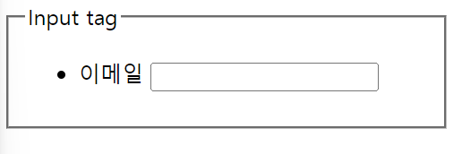

# Form

<a href = 'https://www.youtube.com/watch?v=b-iOa0Rkyb8&list=PLlaP-jSd-nK-ponbKDjrSn3BQG9MgHSKv&index=14'>HTML 강의 Ep08_1 - Form(폼) 태그</a>

# 정의

`Form` : HTML 에서 `Form`은 웹에서 사용자의 정보를 입력받기 위해 사용함

- 예를 들어 로그인, 회원가입, 게시판 글쓰기 등 우리는 사용자의 데이터를 입력받아 데이터를 입력 받음
- 즉, 폼(`Form`) 은 **입력받는 데이터의 묶음** , 입력받은 데이터를 `폼 데이터(Form data)` 혹은 `필드(Field)` 라고 함

<br><br>


```html
<!DOCTYPE html>
<html lang="en">
  <head>
    <meta charset="UTF-8" />
    <meta name="viewport" content="width=device-width, initial-scale=1.0" />
    <title>Form</Form></title>
  </head>
  <body>
    <form action="">
      <div>
        <label for="username">아이디</label>
        <input type="text" id="username" />
      </div>
      <div>
        <label for="password">패스워드</label>
        <input type="text" id="password" />
      </div>
      <input type="submit" value="제출" />
    </form>
  </body>
</html>
```

### 속성

- `action` : 양식 데이터를 처리할 서버의 프로그램 URI

  > `URI (Uniform Resource identifier)`: 인터넷 상에서 특정 자원을 나타내는 고유한 식별자
  >
  > - `URL (Uniform Resource Locator)` : 인터넷 상에서 특정 자원의 위치를 나타내는 주소로 일반적으로 웹 주소로 알려져있음
  > - `URN (Uniform Resource Name)` : 자원의 위치가 아니라 자원 자체를 식별하기 위한 이름, `URL`은 자원의 위치를 제공하지만 `URN` 은 그 자원의 이름만을 제공하며 `URN` 은 상대적으로 적은 사용량을 보인다

- `method` : 양식을 제출할 때 사용할 HTTP 메소드
  - `post` : 양식 데이터를 **요청 본문** 으로 전송
  - `get` : 양식 데이터를 **URL의 쿼리스트링으로** 붙여서 전송

> ### 1. POST 메소드
>
> - 데이터 요청 본문 (body)으로 전송
> - 주로 긴 텍스트, 파일 업로드 등 **큰 양의 데이터** 를 전송 할 때 사용됨
> - 보안적으로 GET 메소드보다 안전하다. 왜냐면 POST 데이터는 URL에 노출되지 않기 때문에
> - 서버로 데이터를 제출 할 떄 사용됨
>
> ### 2. GET 메소드
>
> - 데이터를 URL의 쿼리스트링(query string)으로 붙여서 전송
> - 주로 검색 쿼리 등 **간단한 데이터** 를 전송 할 때 사용됨
> - 브라우저에서 주소창에 직접 입력되는 데이터와 함께 사용됨
> - 브라우저 히스토리에 남아 보안적으로 덜 안전하다. URL이 노출되기 때문에

==> 네트워크 공부를 더 하고 이해하자 오늘부터 네트워크 공부를 시작해야겠다.

# input 태그

`<input>` 요소로 데이터를 입력 받을 수 있음 . `type` 속성을 통해 다양한 방법으로 데이터를 받을 수 있음

##### 필수입력 required

zinput 태그 안에 `required`를 넣으면 해당 `input` 값은 `필수입력칸` 이 된다.


```html
<!DOCTYPE html>
<html lang="en">
  <head>
    <meta charset="UTF-8" />
    <meta name="viewport" content="width=device-width, initial-scale=1.0" />
    <title>Document</title>
    <style>
      fieldset {
        width: 300px;
      }
    </style>
  </head>
  <body>
    <form action="">
      <fieldset>
        <legend>Input tag</legend>
        <ul>
          <li>
            <!-- label 의 for 와 input 의 id 를 일치 시켜줘야 한다 -->
            <label for="email">이메일</label>
            <input type="email" id="email" required />
          </li>
          <li>
            <label for="text">텍스트</label>
            <input type="text" id="text" />
          </li>
        </ul>
      </fieldset>
      <input type="submit" value="제출하기" />
    </form>
  </body>
</html>
```

### input type

`<input>` 태그의 기본값으로 한 줄의 텍스트를 입력받음

```html
<input type="text" id="name" />
```

HTML5 에서는 `text` 필드가 데이터 용도에 맞게 사용 할 수 있도록 다양한 타입이 추가되었음

### 다양한 type

- `email` : email 데이터를 받기 위해 사용되며 이메일 유효성을 검증함
- `tel` : 전화번호를 받기 위해 사용되며 모바일 접근 시 키패드가 다름
  더 많은 `type`은 MDN 사이트를 참고

##### 추가로 엄청 많은 input type


```html
<!DOCTYPE html>
<html lang="en">
  <head>
    <meta charset="UTF-8" />
    <meta name="viewport" content="width=device-width, initial-scale=1.0" />
    <title>Document</title>
    <style>
      fieldset {
        width: 300px;
      }
    </style>
  </head>
  <body>
    <form action="">
      <fieldset>
        <legend>Input tag</legend>
        <ul>
          <li>
            <!-- label 의 for 와 input 의 id 를 일치 시켜줘야 한다 -->
            <label for="email">이메일</label>
            <input type="email" id="email" required />
          </li>
          <li>
            <label for="text">텍스트</label>
            <input type="text" id="text" />
          </li>
          <li>
            <label for="tel">전화번호</label>
            <input type="tel" id="tel" />
          </li>
          <li>
            <label for="url">url</label>
            <input type="url" id="url" />
          </li>
          <li>
            <label for="number">숫자</label>
            <input type="number" id="number" min="5" max="10" />
          </li>
          <li>
            <label for="range">range</label>
            <input type="range" id="range" />
          </li>
          <li>
            <label for="password">password</label>
            <input type="password" id="password" />
          </li>
        </ul>
      </fieldset>
      <fieldset>
        <legend>날짜관련</legend>
        <ul>
          <li>
            <label for="date">date</label>
            <input type="date" id="date" min="2023-01-01" max="2023-12-31" />
          </li>
          <li>
            <label for="month">month</label> <input type="month" id="month" />
          </li>
          <li>
            <label for="week">week</label> <input type="week" id="week" />
          </li>
        </ul>
      </fieldset>
      <fieldset>
        <legend>시간관련</legend>
        <ul>
          <li>
            <!-- 시간도 min , max를 지정하면 자동 유효성 검사-->
            <label for="time">time</label>
            <input type="time" id="time" />
          </li>
        </ul>
      </fieldset>
      <fieldset>
        <legend>그외</legend>
        <ul>
          <li>
            <label for="file">single file</label>
            <input type="file" />
          </li>
          <li>
            <label for="file">multiple file</label>
            <input type="file" multiple />
          </li>
          <li>
            <!-- input type 이 hidden 인 경우엔 UI 상에 나타나지 않음 -->
            <label for="hidden"></label>
            <input type="hidden" name="" value="" />
          </li>
        </ul>
      </fieldset>
      <input type="submit" value="제출하기" min="16:00" max="18:00" />
    </form>
  </body>
</html>
```

### input tag

- `email` : 이메일 양상이 아니라면 제출이 불가능하게 유효성 검사를 함
- `tel` : 모바일에서 접근 시 해당 `input` 에 입력값을 넣으려고 하면 모바일 키패드가 올라옴
- `url` : url 주소가 아니면 제출이 불가능하도록 유효성 검사를 함
- `number` : 숫자를 입력 할 수 있으며 `up , down` 버튼이 생김
- `range` : 범위를 지정 할 수 있음
- `password` : `password` 로 설정시 값을 입력하면 값이 가려지며 복사 붙여넣기도 불가능함

### 날짜 관련 tag

- `date` : 날짜를 설정 가능하며 달력에서 선택 가능
- `month` : 몇 년도 몇 월인지 설정 가능
- `week` : 몇 년도 몇 번째 주인지 설정 가능

### 시간관련

- `time` : 시간 설정 가능

### 그 외

- `file` : `file` 을 업로드 할 수 있으며 `multiple` 속성 사용 시 2개 이상의 파일 업로드 가능
- `hidden` : `hidden` 의 경우 `name` , `value` 속성과 함께 사용하며 `UI` 에서는 보이지 않지만 `서버`측에 데이터를 보내야 할 경우 사용

### label

`<label>` 태그는 입력받은 필드를 설명 할 때 사용함 `웹 접근성 준수`
사용 방법은 `<label>` 태그 하위에 `<input>` 태그를 위치 시킬 수 있고 `id` 와 `for` 속성을 사용하여 `<input>` 태그와 연결 시킬 수 있음

**`<label>` 의 `for` 속성은 `<input>` 의 `id` 속성과 같은 값을 가져야 하는 이유** 는 `label` 의 `for` 속성은 해당 `label`이 어떤 `input` 값과 연결 되어 있는지를 설명해줌으로서 `웹접근성`을 향상 시킨다.


```html
<!DOCTYPE html>
<html lang="en">
  <head>
    <meta charset="UTF-8" />
    <meta name="viewport" content="width=device-width, initial-scale=1.0" />
    <title>Document</title>
    <style>
      fieldset {
        width: 300px;
      }
    </style>
  </head>
  <body>
    <fieldset>
      <legend>Input tag</legend>
      <ul>
        <li>
          <!-- label 의 for 와 input 의 id 를 일치 시켜줘야 한다 -->
          <label for="email">이메일</label>
          <input type="text" id="email" />
        </li>
      </ul>
    </fieldset>
  </body>
</html>
```

### Filedset

`Filedset` 은 HTML 에서 여러 관련된 **양식 요소를 그룹화** 하는데 사용됨
주로 `<form>` 요소 내에서 사용되며 그 안에 `<legend>` 태그를 포함하여 그룹의 제목을 정의함


```html
<!DOCTYPE html>
<html lang="en">
  <head>
    <meta charset="UTF-8" />
    <meta name="viewport" content="width=device-width, initial-scale=1.0" />
    <title>Document</title>
    <style>
      .custom-filedset {
        width: 350px;
        height: 100px;
        position: relative;
      }
      .custom-filedset div {
        display: flex;
        flex-direction: row;
        margin-bottom: 10px;
      }
      .custom-filedset div label {
        margin-bottom: 10px;
        width: 100px;
        margin-right: 0px;
      }
      .custom-filedset div input {
        width: 200px;
        margin: 0px;
      }
      .submitbutton {
        position: absolute;
        bottom: 0;
        right: 0;
        background-color: skyblue;
        color: white;
        border: 1px solid skyblue;
      }
    </style>
  </head>
  <body>
    <form action="">
      <fieldset class="custom-filedset">
        <legend>개인정보</legend>
        <div>
          <label for="username">이름</label>
          <input type="text" />
        </div>
        <div>
          <label for="birth">생년월일</label>
          <input type="text" />
        </div>
        <input type="submit" value="제출" class="submitbutton" />
      </fieldset>

      <fieldset class="custom-filedset">
        <legend>사업자정보</legend>
        <div>
          <label for="companyname">회사이름</label>
          <input type="text" />
        </div>
        <div>
          <label for="companynumber">회사번호</label> <input type="text" />
        </div>
        <input type="submit" value="제출" class="submitbutton" />
      </fieldset>
    </form>
  </body>
</html>
```

> ##### 해당 HTML 문서에서 사용한 CSS 중 `.custom-filedset` 의 `position : relative` 와 `submitbutton` 의 `position : absolute`의 의미
>
> - `.custom-filedset` 의 `position : relative` : 해당 요소를 기준으로 자식 요소의 위치를 조절함
> - `submitbutton` 의 `position : absolute` : 위치 속성을 절대적으로 설정하며 문서의 상대적인 위치가 아니라 최상위 부모 요소를 기준으로 위치 시킨다.

# Form 데이터 태그 속성

- `required` : 입력값이 필수라는 것을 명시 할 수 있음
- `readonly` : 필드를 읽기 전용으로 필드를 만들 수 있음
- `disabled` : 비활성화 시킬 수 있으며 해당 필드는 서버로 전송되지 않음

  > ##### `readonly` vs `disabled`
  >
  > 둘 다 데이터를 수정 할 수 없는 것은 같으나 `readonly` 는 서버로 데이터를 전송하며
  > `disabled` 는 서버로 수정되지 않음

- `autofocus` : 초기에 해당 필드에 커서를 위치 시킬 수 있음
- `placeholder` : 입력 필드가 비어있을 때 설명 또는 가이드 문구를 삽입 할 수 있음


```html
...

<form action="">
  <fieldset>
    <legend>Input tag</legend>
    <ul>
      <li>
        <!-- label 의 for 와 input 의 id 를 일치 시켜줘야 한다 -->
        <label for="email">이메일</label>
        <input type="email" id="email" readonly value="readonly" />
      </li>
      <li>
        <label for="text">텍스트</label>
        <input type="text" id="text" disabled value = 'disabled입니다' / >
      </li>
      <li>
        <label for="tel">전화번호</label>
        <input type="tel" id="tel" autofocus />
      </li>
      <li>
        <label for="url">url</label>
        <input type="url" id="url" placeholder="url을입력하셈요" />
      </li>
    </ul>
  </fieldset>
</form>
```

# CheckBox

여러개의 체크박스 항목 중 2개 이상 선택 할 수 있음

체크박스 선택 시 선택된 체크박스의 `value` 값이 서버로 전송된다.

# radio

여러개의 라디오 항목 중 1개를 선택 할 수 있다.

그리고 라디오 항목 선택 시 선택된 항목의 `value`값이 서버로 전송된다.

여러개 중 하나를 선택되게 하려면 그 여러 항목의 `radio name =''` 의 `name` 속성 값을 같은 값으로 해야 한다.

<br><br>


```html
<!DOCTYPE html>
<html lang="en">
  <head>
    <meta charset="UTF-8" />
    <meta name="viewport" content="width=device-width, initial-scale=1.0" />
    <title>radiocheckbox</title>
  </head>
  <body>
    <form action="">
      <fieldset>
        <legend>좋아하는 색상을 모두 선택해주세요</legend>
        <ul>
          <li>
            <label for="red">빨강</label>
            <input type="checkbox" id="red" value="red" />
          </li>
          <li>
            <label for="red">주황</label>
            <input type="checkbox" id="orange" value="red" />
          </li>
          <li>
            <label for="red">노랑</label>
            <input type="checkbox" id="yellow" value="red" />
          </li>
          <li>
            <label for="red">초록</label>
            <input type="checkbox" id="green" value="red" />
          </li>
          <li>
            <label for="red">파랑</label>
            <input type="checkbox" id="blue" value="red" />
          </li>
        </ul>
      </fieldset>
      <fieldset>
        <legend>선호하는 배송 방식은</legend>
        <ul>
          <li>
            <label for="free">무료</label>
            <input type="radio" name="delivery" id="free" value="free" />
          </li>
          <li>
            <label for="pay">유료</label>
            <input type="radio" name="delivery" id="pay" value="pay" />
          </li>
        </ul>
      </fieldset>
    </form>
  </body>
</html>
```

> `checkbox` 는 여러개 중복 선택하여 서버로 제출
> `radio` 는 여러개 중 단일 선택하여 서버로 제출
>
> - `radio` 의 경우 단일 선택하기 위해서 다양한 `input` 값들을 같은 `name` 으로 그룹핑 해야 단일 선택이 가능

# Textarea

`<textarea>` 의 경우 여러줄의 데이터를 입력받을 수 있음

### 속성

- `rows` : 화면에 표시되는 행 수를 지정
- `cols` : 화면에 표시되는 열 수를 지정


````html
<fieldset>
  <legend>자기소개서</legend>
  <label for="selfintroduction"></label>
  <textarea
    name="introduction"
    id="selfintroduction"
    cols="30"
    rows="5"
    placeholder="자기소개서를 입력해주세요"
  ></textarea>
</fieldset>
```
````

- `name` : `textarea` 가 서버로 제출 될 때 같이 제출 되는 이름
- `<textarea>콘텐츠</textarea>` 를 통해서 기본적으로 `textarea` 에 내용을 적어둘 수도, `placeholder`로 미리쓰기처럼 나타낼 수도 있음

# Select

- `<select>` 태그는 옵션 메뉴를 제공한다.
- `<option>` 태그로 각 항목을 나타내며 `<select>` 태그는 `<option>` 태그를 감싼다.


```html
<fieldset style="width: 400px">
  <legend>사과 뭐드실레예?</legend>
  <ul>
    <li>
      <label for="apple">먹을 사과 양을 하나만 선택하세요</label>
      <select name="appleorder" id="apple">
        <option value="10kg">사과 10kg</option>
        <option value="20kg" selected>사과 20kg</option>
        <option value="30kg">사과 30kg</option>
        <option value="40kg">사과 40kg</option>
        <option value="50kg">사과 50kg</option>
      </select>
    </li>
    <li>
      <label for="apple_multiple">먹을 사과를 여러개 선택하세요</label>
      <select name="appleorder" id="apple" multiple>
        <option value="10kg">사과 10kg</option>
        <option value="20kg" selected>사과 20kg</option>
        <option value="30kg">사과 30kg</option>
        <option value="40kg">사과 40kg</option>
        <option value="50kg">사과 50kg</option>
      </select>
    </li>
  </ul>
</fieldset>
```

옵션 안에 있는 내용은 사용자 화면에 보여주는 내용이며 실제 서버로 전송되는 값은 `value` 안의 값이다.

### 속성

- `selected` 해당 속성은 현재 `select` 요소에서 선택된 항목(`<option>`) 을 가리킨다.

# datalist

다른 컨트롤에서 고를 수 있는 가능한, 혹은 추천하는 선택지를 나타내는 `<option>` 요소를 여럿 담는다.

# Button

`<button>` 요소는 클릭 가능한 버튼을 나타낸다. `<form>` 내부는 물론이고 버튼 기능이 필요한 곳이라면 어디든 배치 할 수 있다.

### type

- `submit` : 버튼이 서버로 양식 데이터를 제출한다 (기본값)
- `reset` : `<input type = 'reset'>` 처럼, 모든 입력 필드를 초기값으로 되돌린다.
- `button` 은 기본 행동이 없으며 주로 클릭한 후 자바스크립트 측 코드를 명령 할 때 사용된다.
