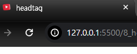

# head tag


`head tag` 는 `UI` 에 직접적으로 보이지는 않지만 문서의 기본적인 `메타데이터(meta data)` 및 스타일, 링크 , 스크립트 등의 정보를 제공하거나 `파비콘` 과 같은 이미지를 삽입한다.

> `파비콘` : 웹 페이지를 대표하는 아이콘으로, 주로 웹 브라우저의 주소 표시줄, 탭, 북마크 등에서 활용되며, 웹 사이트의 로고나 식별자와 같은 이미지를 작은 크기로 나타내어 사용자에게 해당 웹 페이지를 쉽게 식별 할 수 있게 도와줌

# head 안에 배치 할 수 있는 요소

- `<title>` : 브라우저 상단에 위치
- `<base>` : 문서 안의 모든 상대 `URL`이 사용할 기준 `URL` 을 의미
- `<link>` : 현재 문서와 외부 리소스 관계를 명시한다. `<link>`는 스타일 시트를 연결 할 때 제일 많이 사용하지만, 사이트 아이콘 (`파비콘`) 연결 등 여러가지로 쓰일 수 있음
- `<style>` : 스타일 규칙

1. `link`



```html
<!DOCTYPE html>
<html lang="en">
  <head>
    <meta charset="UTF-8" />
    <meta name="viewport" content="width=device-width, initial-scale=1.0" />
    <title>headtag</title>
    <link rel="shortcut icon" href="asset/youtube_icon.ico" />
  </head>
  <body></body>
</html>
```

`href` 속성에 `.ico` 의 위치를 써주면 `파비콘` 에 내가 설정한 아이콘이 되는 모습을 볼 수 있다.

2. `<base>`

위에서 `href` 의 속성이 `asset/youtube_icon.ico` 으로 설정 되어 있었다.

이는 내 현재 `html` 문서의 경로로부터 `asset` 이라는 하위 문서에 들어간 후에 `youtube_icon.ico` 에 접근했었다.

그러니 현재 문서의 `상대위치` 로 `파비콘` 파일에 접근했다.

이 때 `<base href = '위치'>` 를 설정해준다면 내 `상대 위치`는 `base` 에 지정된 위치로 포함되어서 나타난다.

```html
<!DOCTYPE html>
<html lang="en">
  <head>
    <meta charset="UTF-8" />
    <meta name="viewport" content="width=device-width, initial-scale=1.0" />
    <title>headtag</title>
    <base href="/asset/" />
    <link rel="shortcut icon" href="./youtube_icon.ico" />
  </head>
  <body></body>
</html>
```

`base` 태그가 설정된 후 `./youtube_icon.ico"` 는 사실 `asset/youtube_icon.ico"` 이 되는 거다.

3. `meta`

`base` , `link` , `script` , `title` 과 같은 다른 메타 관련 요소로 나타낼 수 없는 데이터를 나타낸다.

4. `script`

데이터나 자바스크립트 코드를 웹 문서에 포함 할 때 사용한다.
