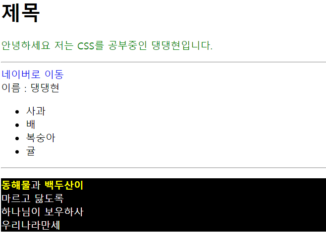
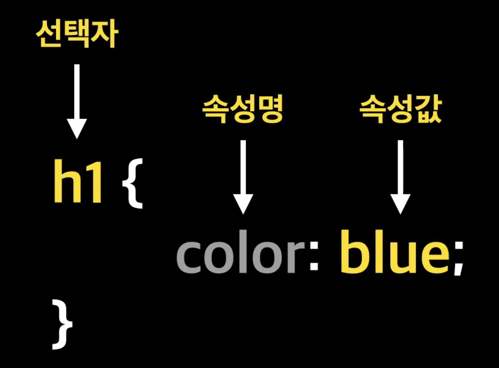
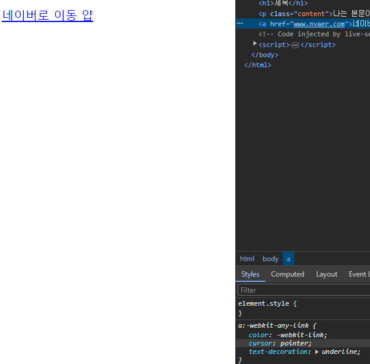
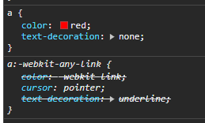
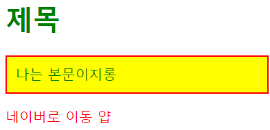
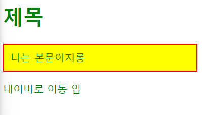

# CSS

# 정의 : `Canscading Style Sheets`

# 배우기 전 실습으로 먼저 보자



```html
<!DOCTYPE html>
<html lang="en">
  <head>
    <meta charset="UTF-8" />
    <meta name="viewport" content="width=device-width, initial-scale=1.0" />
    <title>CSS</title>
  </head>
  <style>
    .green--text {
      color: green;
    }
    .text-decoration-none {
      text-decoration: none;
    }
    #dark {
      background-color: black;
      color: white;
    }

    .yellow {
      color: yellow;
      font-weight: bold;
    }
  </style>
  <body>
    <h1>제목</h1>
    <p class="green--text">안녕하세요 저는 CSS를 공부중인 댕댕현입니다.</p>
    <hr />
    <a class="text-decoration-none" href="www.naver.com">네이버로 이동</a>
    <br />
    <span>이름 : </span><span>댕댕현</span>
    <ul>
      <li>사과</li>
      <li>배</li>
      <li>복숭아</li>
      <li>귤</li>
    </ul>
    <hr />
    <p id="dark">
      <span class="yellow">동해물</span>과 <span class="yellow">백두산이</span
      ><br />
      마르고 닳도록<br />
      하나님이 보우하사 <br />
      우리나라만세
    </p>
  </body>
</html>
```

`html` 로 구조를 짠 후 `태그` 에 `클래스` 나 `id` 를 부여 한 후
`<style>` 태그 안에서 `클래스` 나 `id`를 내 마음대로 스타일링이 가능한 모습을 볼 수 있다.

# CSS 의 구조



- `선택자` : 꾸미고 싶은 `태그` 선택
- `속성명` : 꾸미고 싶은 `태그` 의 어떤 것을 꾸밀지를 결정
- `속성값` : `속성명` 에 맞는 값을 의미

**CSS를 배운다는 것은 `속성명` 에 맞는 `속성값` 을 외워가는 것과 같음**

# CSS 적용 방법

- `인라인 스타일` : `Inline Style Sheet`
- `내부 스타일` : `Interal Style Sheet`
- `외부 스타일` : `External Style Sheet`

### 1. `Inline Style`

```html
<!DOCTYPE html>
<html lang="en">
  <head>
    <meta charset="UTF-8" />
    <meta
      name="viewport"
      content="width=
    , initial-scale=1.0"
    />
    <title>inline-style</title>
  </head>
  <body>
    <h1 style="color: blue">제목</h1>
    <div style="width: 100px; height: 200px; border: 1px solid blue">
      div 영역입니다요
    </div>
  </body>
</html>
```

- 다음처럼 태그 내에서 `style` 을 지정해주는 것으로 불변하는 요소에 대해서 쓰이기도 하지만 현업에서는 가독성이 떨어져 잘 사용하지 않음

### 2. `Internal Style Sheet`

```html
<!DOCTYPE html>
<html lang="en">
  <head>
    <meta charset="UTF-8" />
    <meta name="viewport" content="width=device-width, initial-scale=1.0" />
    <title>internal_style</title>
    <style>
      h1 {
        color: blue;
      }
      .content {
        border: 2px solid red;
        background-color: yellow;
        padding: 10px;
      }
    </style>
  </head>
  <body>
    <h1>제목</h1>
    <p class="content">나는 본문이지롱</p>
  </body>
</html>
```

- `head` 태그 안에 `<style>` 태그로 지정하여 CSS를 사용함
- 하지만 현업에서는 잘 사용하지 않는다.
  - 이유는 여러개의 HTML 파일에 동일한 클래스와 CSS를 사용 할 것이라면 동일하게 `<style>` 태그 안에 넣어줘야 하는데 너무 불편함

### 3. `External Style`

```html
<!DOCTYPE html>
<html lang="en">
  <head>
    <meta charset="UTF-8" />
    <meta name="viewport" content="width=device-width, initial-scale=1.0" />
    <title>External Style</title>
    <link rel="stylesheet" href="style.css" />
  </head>
  <body>
    <h1>코딩</h1>
    <p>우리는 코딩을 배우고 있어요</p>
    <p class="article">사실은 마크업 언어지롱</p>
  </body>
</html>
```

```css
h1 {
  color: blue;
}
.article {
  border: 1px solid black;
  padding: 30px;
  color: red;
}
```

- `.css` 확장자를 가진 `<style>` 태그 안에 들어갈 것을 태그 없이 작성한 후 `head` 태그 안에 `<link rel = 'stylesheet' href = '상대경로'>` 를 지정해줘 외부 문서에 있는 `style` 규칙을 적용 가능

# CSS 주석

`/* 메모내용 */` 를 이용하여 사용 가능

# CSS 출처

CSS 는 `브라우저 기본 스타일` , `브라우저 사용자 스타일` , 우리가 만든 `제작자 스타일`로 분류 할 수 있음

### CSS 출처 3가지

- 제작자 스타일(Author Style)
  제작자 스타일은 말 그대로 웹 사이트를 제작하는 `우리가 작성한 스타일 시트`
- 사용자 스타일 (User Style)
  사용자 스타일은 사이트를 방문하는 일반 사용자들이 구성한 스타일 시트를 말 함
  예를 들어 저시력자를 위한 윈도우의 `고대비` 설정 기능을 사용하는 사람이 있을 경우 그런 스타일이 시스템에 저장되게 되는데 이것이 사용자 스타일 시트
- 브라우저 스타일 (Browser Style)
  `브라우저` 들마다 기본적으로 지정하고 있는 `스타일`
  크롬, 사파리, 파이어폭스 등 브라우저 마다 기본 스타일 시트가 다를 수 있음
  > 예를 들어 `a` 태그로 작성한 문구에 밑줄이 자동으로 쳐지는 것과 같음

# CSS 출처 적용 우선 순위

`사용자 !important` > `제작된 important` > `제작자` > `사용자` > `브라우저`

- `important` 가 지정된 스타일이 우선적으로 지정되며 이후 `제작자` , `사용자` > `브라우저` 순
- 주의사항
  `!important` 는 폭포의 흐름을 깰 수 있으니 주의해서 사용해야 한다.

### CSS 적용 우선 순위 예시



나는 현재 `a` 태그에 어떠한 스타일도 지정하지 않았음에도 `브라우저` 의 적용 원칙에 따라서 현재 `a` 태그의 스타일은

```css
a {
  color: -webkit-link;
  cursor: pointer;
  text-decoration: underline;
}
```

이 지정되어 있는 모습을 볼 수 있다.

이 때 내가 `a` 태그의 스타일 속성을 변경한다고 해보자



````css
      a {
        color: red;
        text-decoration: none;
      }```
````

`제작자` 의 우선순위가 더 높기 때문에 현재 문서 내에서 `a` 태그의 스타일 속성이 변경된 모습을 볼 수 있다.

### 태그 내에서의 우선순위



````css
      * {
        color: green;
      }
      a {
        color: red;
        text-decoration: none;
      }```
````

`*` 는 모든 `태그`에 대해서 일관된 속성을 부여한다.

이 때 `*` 태그를 했음에도 불구하고 `a` 태그는 고유의 속성을 가지게 설정해놨기 때문에 `a`태그는 `*` 태그의 속성을 갖지 않은 것을 볼 수 있다.

하지만 **`*` 태그에 `!important`** 를 부여한다면


````css
      * {
       color: green !important;
     }
     a {
       color: red;
       text-decoration: none;
     }
     ```
````

`!important` 가 주어진 속성이 가장 우선적으로 부여되는 모습을 볼 수 있다.

# Cascading 뜻

`Casdacading Style Sheet` 에서 Cascading 은 폭포라는 뜻을 갖고 잇음

HTML 문서는

- 제작자 스타일을 우선 적용하고 ->
  - 브라우저 사용자 스타일 ->
  - 브라우저 기본 스타일을 적용

이처럼 Cascading의 뜻인 폭포와 같이 스타일이 우선순위에 맞게 `연속적으로 적용`됨을 의미함
