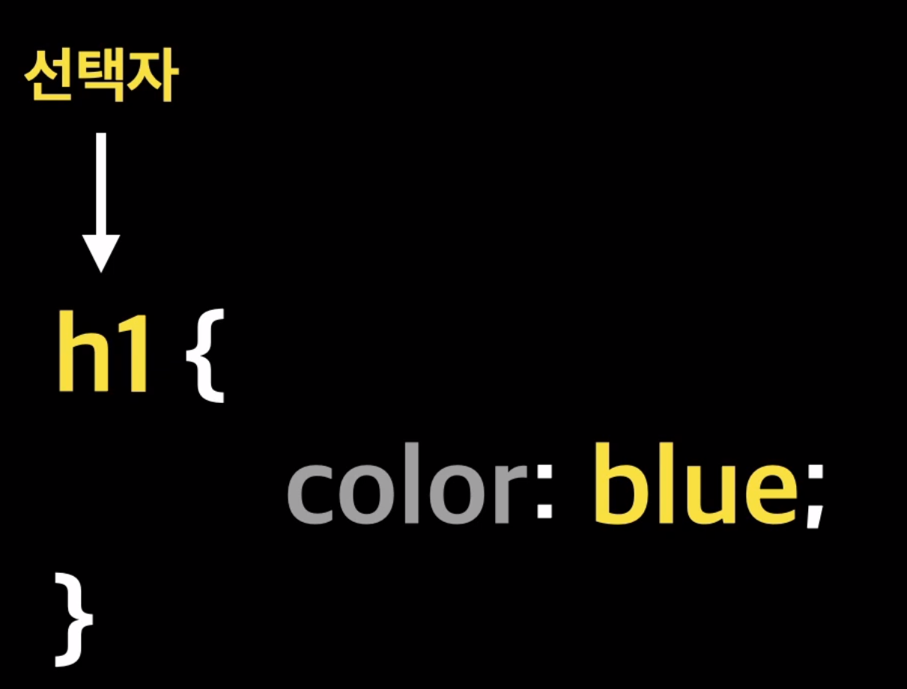

# Selector (선택자)



- HTML 태그를 선택하는 것을 `선택자` 라고 함

### 전체 선택자

- `전체 선택자` 는 브라우저의 기본 설정을 초기화 할 때 사용한다.

```css
    <style>
      * {
        margin: 0px;
        padding: 0px;
      }
    </style>
```

### 타입 선택자

```css
h2 {
  color: green;
}

p {
  color: gray;
  font-weight: 300;
  text-align: center;
}
```

### 클래스 선택자

```css
.red {
  color: red;
}
.blue {
  color: blue;
}
```

### id 선택자

```css
/* id 선택자 */
/* id 선택자는 고유해야 한다. */
#title {
  font-size: 40px;
  color: darkgray;
  background-color: yellow;
}
```

### 속성 선택자

- 주어진 속성을 가진 모든 요소를 검색한다.

> 문법
>
> - `[attr]` : 해당 속성을 가지고 있는 태그 선택
> - `[attr = value]` : 해당 속성의 속성 값이 `value` 인 태그 선택
> - `[attr~= value]` : 해당 속성의 속성 값이 `value` 단어를 포함한 태그 선택
> - `[attr|= value]` : 해당 속성의 속성 값이 `value` 이거나 `value` 로 시작하는 태그 선택
> - `[attr^= value]` : 해당 속성의 속성 값이 `value` 로 시작하는 태그 선택
> - `[attr$= value]` : 해당 속성의 속성 값이 `value` 로 끝나는 태그 선택
> - `[attr*= value]` : 해당 속성의 속성 값이 `value` 인 태그 선택

```css
    <style>
      /* 속성이 존재하는 요소에 스타일 매기기 */
      h2[class] {
        font-size: 30px;
        color: red;
      }

      h2[target] {
        color: green;
      }

      /* 속성 값과 일치하는 요소 */

      h2[class='naver-title'] {
        color: blue;
      }

      /* 속성 값을 포함하는 요소 */
      a[href*='face'] {
        text-decoration: none;
      }

      /* 속성 값으로 시작하는 요소 */
      h2[class^='google'] {
        color: salmon;
      }

      /* 속성 값으로 끝나는 요소 */
      a[href$='daum.net'] {
        color: aqua;
      }
      /* 속성에 단어가 포함하는 요소 */
      a[class~='title'] {
        color: aquamarine;
      }
    </style>
```

# 그룹 선택자

- 선택자를 쉼표(,) 로 구분해 여러 선택자를 나열함
  같은 스타일을 여러 선택자에 한꺼번에 정의 할 수 있다.

```css
h1,
h2 {
  text-align: center;
}
```

# 결합자

### 자손 결합자

자손` `(공백) 결합자는 첫 번째 요소의 자손인 태그를 선택한다.

- `문법`
  `A B` : `A`선택자 하위에 있는 `B` 선택자를 모두 선택함

```css
div span {
  color: blue;
}
```

### 자식 결합자

- `문법` : `A > B` : `A` 선택자 하위에 있는 `B` 선택자를 선택함

### 자손 결합자와 자식 결합자의 차이가 뭔데 ?

`자손`과 `직계 자식`에 대해서 구분해보자.

```html
<div>
  <p>직계 자식</p>
  <div>
    <p>자손</p>
  </div>
</div>
```

다음처럼 있을 때 `자손 결합자` 인 `div p` 를 사용하게 되면 `div` 안에 있는 모든 `p` 태그에 대해서 선택하게 되며
`div > p` 를 사용하게 되면 `div` 태그 바로 다음에 있는 `p` 태그인 `직계 자식` 에 대해서만 적용이 된다.

```html
<div>
  <p>
    div의 직계 자손<br />
    <span>div 의 자손</span>
  </p>
</div>
```

다음과 같은 구문이 있을 때

```css
div span {
  background-color: hotpink;
}
```

를 사용하게 되면 `div` 안에 있는 모든 자손 중 `span` 태그를 골라 적용이 된다.

```css
div > span {
  background-color: hotpink;
}
```

하지만 직계 자손인 `>` 를 사용하게 되면 `div` 의 직계 자손은 `p` 태그이며 `span` 태그는 `div` 의 자손이지 `div` 태그의 직계 자손은 아니다.

`div` 의 직계 자손은 `p` 태그이며 `span` 태그는 `p` 태그의 직계 자손이다.

# 일반 형제 결합자

`형제 태그` 란 `같은 부모 태그` 를 갖는 태그를 의미한다.

이 때 `형제 태그` 들끼리 묶고 싶을 때에는 `형제 태그 A ~ 형제 태그 B` 로 사용한다.

이렇게 되면 `A` 태그 이후부터 등장하는 `B` 태그를 선택하게 된다.

# 인접 형제 결합자

- `표기법`: `+`
- `A + B` 로 사용하게 될 경우 `A` 태그와 형제태그이면서 바로 다음에 등장하는 `B` 태그에 대해서 선택하게 된다.
