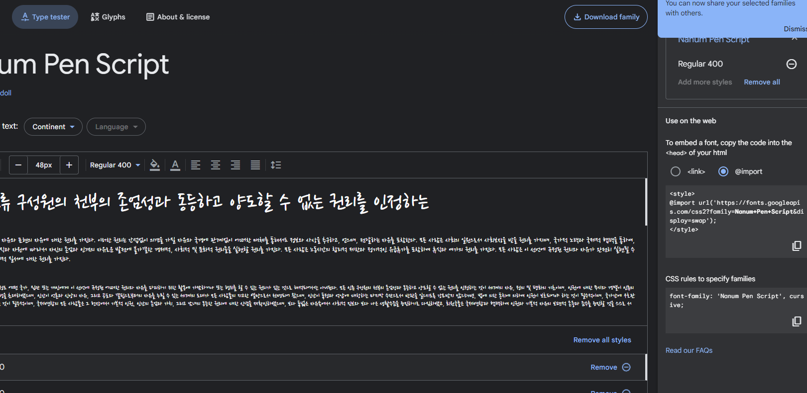
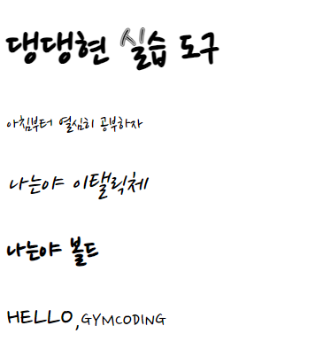
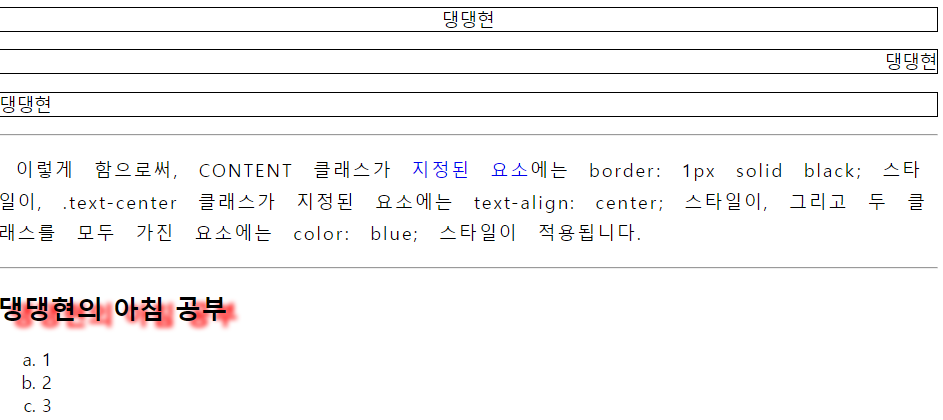

# CSS 속성 - 폰트

# 글꼴 관련 속성 (`MDN`)

- `font-family` : 글꼴 종류 지정
  > `font-family` 의 경우 `,` 를 이용해 다양한 폰트를 배치 할 수 있으며 배치된 순으로 적용되며 `웹브라우저`에서 지원하지 않는 폰트일 경우 `,` 다음 폰트가 적용됨
  - `기본값` : 웹 브라우저 기본 글꼴
- `font-size` : 글자 크기 지정
- `font-style` : 글자를 이탤릭체로 표시할지 지정
- `font-weight` : 글자 굵기 지정
- `font-variant` : 소문자를 작은 대문자로 바꾸는 속성

# 웹폰트

사용자의 컴퓨터에 설치된 폰트와 상관없이 **온라인의 특정 서버에 위치한 폰트 파일** 을 다운로드 하여 화면에 표시해주는 `웹 전용 폰트`

- 구글 웹 폰트

<a href = 'https://fonts.google.com/?subset=korean&noto.script=Kore'>`구글 웹폰트 사이트`</a>



사용 할 폰트를 선택 후 어떤 방식으로 웹에서 사용 할지를 선택
`@import` 를 이용해서 실습해보기로 함



```html
<style>
  @import url('https://fonts.googleapis.com/css2?family=Nanum+Pen+Script&display=swap');
  html {
    font-family: 'Nanum Pen Script', cursive;
    font-size: 28px;
  }
  .content {
    font-size: 18px;
  }
  .font-italic {
    font-style: italic;
  }
  .font-weight {
    font-weight: bold;
  }
  .font-variant {
    font-variant: small-caps;
  }
</style>
...
```

- `@import` 로 `웹서버` 에서 폰트 관련 소스를 가져오고 `font-family` 를 이용해 사용할 폰트를 설정한다.

# 단위 (`em` , `rem`)

- `px` : 픽셀 단위로 글자 단위 지정
- `rem` : 루트 요소(`최상위 부모 태그`) 단위의 몇 배를 할 것인지
- `em` : ` 직속 부모 요소로부터 상속`받은 단위의 몇 배를 할 것인지
- `vw` : `viewport-width` 의 약자로 `viewport-width` 와의 비율
- `vh` : `viewport-height` 의 약자로 `viewport-height` 와의 비율

# 글자 색상

글자 색상은 `color`속성으로 지정하며 색상 값으로는 `16진수 값` , `rgb 값` , `hsl 값` , `색상이름`이 사용됨

### `색상 키워드` 표기법

색상 키워드는 대소문자를 구별하지 않는 식별자로 특정 색을 명시함
이름이 표현하는 색을 그럭저럭 가리키고 있긴 하지만 모든 키워드의 본질은 인위적이며 어떤 특정한 규칙을 따르거나 하지 아니함

- `transparent` 키워드
  transparent 키워드는 완전히 투명한 색으로 색을 입힌 항목의 뒷편이 모두 보인다. 기술적으로 `transparent` 는 rgba(0,0,0,0)의 짧은 이름
- `currentColor` 키워드
  `currentColor` 키워드는 요소의 `color` 속성값을 나타냄. 이를 통해 다른 속성이 `color` 속성값을 따라가도록 설정 가능

### `RGB/RGBA` 표기법

RGB 색상 모델은 빨강, 초록, 파랑을통해 특정 색을 표현함. `선택사항의 색의 투명도` 를 알파 채널로 표현 할 수 있음

함수형 표기법 (`rgb()` , `rgba()`) 로 표현 할 수 있음

### `16진수 표기법`

RGB 색상 모델은 빨강, 초록, 파랑 등을 통해 특정 색을 표현함
RGB 색상의 값을 #뒤의 16진수 표기법으로 표현 할 수 있음

# 그 외 글자 관련 속성



```html
<!DOCTYPE html>
<html lang="en">
  <head>
    <meta charset="UTF-8" />
    <meta name="viewport" content="width=device-width, initial-scale=1.0" />
    <title>Document</title>
    <style>
      .content {
        border: 1px solid black;
      }
      .text-center {
        text-align: center;
      }
      .text-right {
        text-align: right;
      }
      .text-left {
        text-align: left;
      }
      .article {
        line-height: 1.8rem;
        letter-spacing: 2px;
        word-spacing: 10px;
        text-indent: 1rem;
      }

      .transform-case {
        text-transform: uppercase;
      }

      .article > a {
        text-decoration: none;
      }
      .text-shadow {
        text-shadow: 10px 5px 5px red;
      }

      ul {
        list-style: lower-latin;
      }
    </style>
  </head>
  <body>
    <section>
      <p class="content text-center">댕댕현</p>
      <p class="content text-right">댕댕현</p>
      <p class="content text-left">댕댕현</p>
    </section>
    <hr />
    <section>
      <p class="article">
        이렇게 함으로써, <span class="transform-case">content</span> 클래스가
        <a href="#">지정된 요소</a>에는 border: 1px solid black; 스타일이,
        .text-center 클래스가 지정된 요소에는 text-align: center; 스타일이,
        그리고 두 클래스를 모두 가진 요소에는 color: blue; 스타일이 적용됩니다.
      </p>
    </section>
    <hr />
    <section>
      <h2 class="text-shadow">댕댕현의 아침 공부</h2>
    </section>

    <section>
      <ul>
        <li>1</li>
        <li>2</li>
        <li>3</li>
      </ul>
    </section>
  </body>
</html>
```

- `text-align` : 글자 정렬 (`center`, `left`, `right` 등 존재)
- `line-height` : 줄간격
- `letter-spacing` : 글자 간격
- `word-spacing` : 10px
- `text-indent` : 들여쓰기 간격
- `text-decoration` : 글자 꾸미기 (`a 태그에 주로 사용`)
- `text-shadow` : 글자 그림자 효과 (3가지 파라미터 존재 `본글자로부터 좌로 얼만큼, 아래로 얼만큼 , 얼마나 번지게 할지 ,`)
- `list-style` : `ul` 태그에 주로 사용 , `마커의 스타일`

> 뭐 많은데 달달 외울 생각 하지 말고 만들다보면 익혀진대
