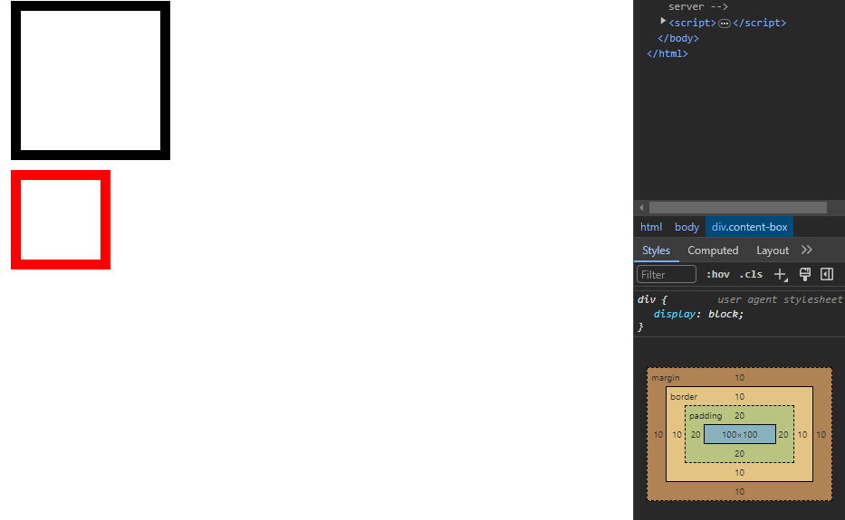

# Box Model

모든 `HTML` 요소는 웹 페이지에서 일정 공간을 차지하게 된다.

이러한 공간을 CSS 에서는 박스 모델로 정의하고 있다.

HTML 요소의 박스 모델은 `content` , `padding` , `border` , `Margin` 으로 구성되어 있다.


- `content` : 텍스트나 이미지가 들어있는 HTML 요소의 실질적 내용
- `Padding` : Content 와 Border 사이의 여역으로 , 쉽게 말해 여백
- `Border` : `content` 를 감싸는 테두리
- `Margin` : 테두리와 이웃하는 요소 사이의 간격으로, 쉽게 말해 바깥쪽 여백

모든 HTML 요소의 박스모델은 이렇게 구성되어 있으며, 웹브라우저 > 개발자도구 > Computed 탭에서 박스 모델 확인 가능


```html
<!DOCTYPE html>
<html lang="en">
  <head>
    <meta charset="UTF-8" />
    <meta name="viewport" content="width=device-width, initial-scale=1.0" />
    <title>Document</title>
    <style>
      div {
        background-color: bisque;
        width: 200px;
        height: 200px;
        border: 10px solid green;
        margin: 40px;
      }
    </style>
  </head>
  <body>
    <div></div>
  </body>
</html>
```

### Content

- `width` , `height` 로 인해 가로, 세로 너비를 지정 할 수 있음
  > 인라인 레벨 요소에서는 `width` , `height` 가 적용되지 않는다.인라이 ㄴ요소는 콘텐츠 만큼의 영역을 가지고 있기 때문이다.
  > 만약 인라인 요소에 `width` , `height` 를 변경하고 싶다면 `display : inline-block` 으로 변경해야 한다.
  - `inline-block` : 요소는 `inline` 인데 내부는 `block`처럼 표시함

### pading

- `padding`은 HTML 요소의 안쪽 여백을 지정함
- `padding` + `'left` , `right` , `bottom` , `top` 으로 상하좌우 패딩 영역 설정 가능

> `padding : [] []` -> 상하, 좌우 px
> `padding : [] [] []` -> 위 좌우 아래
> `padding : [] [] [] []` -> 위 오른쪽 아래 좌우
> 현업에선 2개를 자주 쓴다

### 바깥 여백 Margin

Margin 도 Padding 과 이하 동문

> 하지만 Margin 은 바깥쪽 여백입니다요

#### 마진 중첩

HTML 요소를 세로로 배치할 경우 `margin` 과 `margin` 이 만날 때 `margin`값이 큰 쪽으로 겹쳐지는 것을 의미함

요소를 가로로 배치할 경우엔 상관 없지만 세로로 배치 할 경우에는 값이 큰 `margin` 만 적용된다.


위는 `margin-bottom : 40px` , 아래는 `margin : 20px` 이지만 두 세로 `margin` 이 겹쳐져서 위의 `margin-bottom` 안에 아래의 `margin` 값이 중첩된 모습을 볼 수 있다.

> 가로는 상관이 없는데 세로만 그래유

# 테두리 `Border`

- `border-style`

  - 어떤 형태의 테두리 스타일을 지정 할 지 나타냄
  - 4개 방향의 값을 한꺼번에 지정 할 때는 방향 순서를 지켜야 한다.

  ```html
  border-style : solid; border-style : dotted solid dashed solid;
  border-left-style : solid;
  ```

- `border-width` : 테두리의 두께 지정
- `border-color` : 테두리의 컬러 지정
- `border` : `style` , `width` , `color` 를 한꺼번에 지정 가능
- `border-radius` : 테두리의 둥그런 정도


```css
div.radius {
  border: 1px solid black;
  width: 100px;
  height: 100px;
  margin: 20px;
  border-radius: 30%;
  padding: 30px;
  display: flex;
  justify-content: center;
  align-items: center;
}
```

> `display : flex` : 해당 요소는 플렉스 컨테이너가 되어 내부의 자식 요소들을 수평 또는 수직으로 배치 할 수 있게함
> `justify-content : center` 플렉스 컨테이너 내의 자식 요소들을 가로로 정렬
> `align-items : center` : 플렉스 컨테이너 내의 자식 요소들을 세로로 정렬

# Box Sizing

`Box Sizing` 은 HTML 요소의 너비와 높이를 계산하는 방법을 지정한다.

- `box-sizing`



```css
.content-box {
  width: 100px;
  height: 100px;
  border: 10px solid black;
  margin: 10px;
  padding: 20px;
  box-sizing: content-box;
}

.border-box {
  width: 100px;
  height: 100px;
  border: 10px solid red;
  margin: 10px;
  padding: 20px;
  box-sizing: border-box;
}
```

두 `div` 모두 같은 `width , height` 를 가졌지만 `box-sizing` 을 어떻게 설정하느냐에 따라서 다른 크기를 갖는 걸 볼 수 있다.

`box-sizing : content-box` 는 `content` 영역의 크기가 설정한 `width , height`
`box-sizing : border-box` 는 `border` 까지의 영역의 크기가 설정한 `width , height`

> `view-port` 너비에 따라서 `div` 값들을 설정해야 하는데 `div` 너비를 계산 할 때 `borer-box` 에서 설정하면 편하곘쥬 ?
