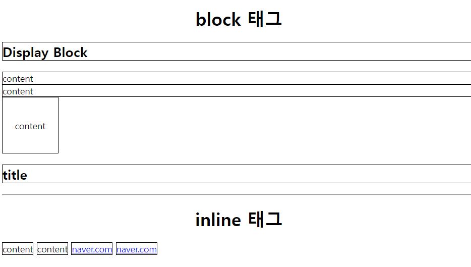
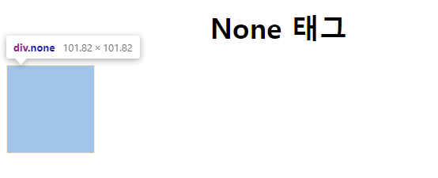
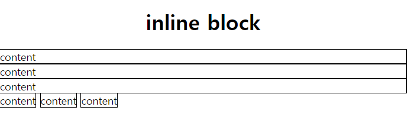
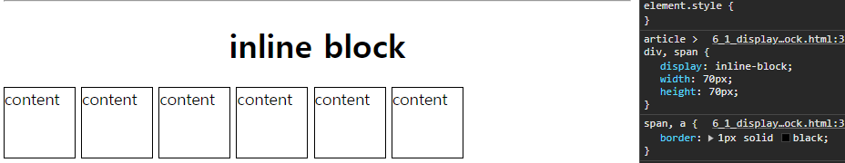

# Display

### display 속성

`display` 속성은 HTML 요소를 어떻게 표시할 지를 결정한다.

### 기본 4가지 값

#### `display : block` , `display : inline`

- `display : block` : Block level Element
  - 기본적으로 가로 영역을 모두 채우며, block 요소 다음에 등장하는 태그는 줄바꿈이 된 것처럼 보인다. 문서에서 문단을 표시할 때 주로 사용한다.
  - `width` , `height` 속성을 지정 할 수 있다.
  - `div , p , h1~h6` 태그 등이 이에 해당된다.
- `display : inline` : Inline level Element

  - 컨텐츠만큼 영역을 차지한다.
  - block 과 달리 줄바꿈이 되지 않고 `width , height` 를 지정 할 수 없다.
  - `word`같은 문서에서 볼드 , 이탤릭, 색상, 밑줄 등 글자나 문장에 효과를 주기 위해 존재하는 단위라고 할 수 있음



```html
<!DOCTYPE html>
<html lang="en">
  <head>
    <meta charset="UTF-8" />
    <meta name="viewport" content="width=device-width, initial-scale=1.0" />
    <title>display-block</title>
    <style>
      h1 {
        text-align: center;
      }
      div,
      h2 {
        border: 1px solid black;
      }

      div.width-control {
        width: 100px;
        height: 100px;
        display: flex;
        justify-content: center;
        align-items: center;
      }

      span,
      a {
        border: 1px solid black;
      }
    </style>
  </head>
  <body>
    <h1>block 태그</h1>
    <h2>Display Block</h2>
    <div>content</div>
    <div>content</div>
    <div class="width-control">content</div>
    <h2>title</h2>
    <hr />
    <h1>inline 태그</h1>
    <span>content</span>
    <span>content</span>
    <a href="#">naver.com</a>
    <a href="#">naver.com</a>
  </body>
</html>
```

`display : block` 인 경우 가로 영역을 모두 채우기 때문에 `width` 를 따로 조정하지 않는다면 모든 영역을 채우는 모습을 볼 수 있다.

그렇기 때문에 `줄바꿈`이 자동으로 되며 `width , height` 를 지정해도 자동으로 줄바꿈이 된다.

`display : inline` 인 경우에는 `content` 영역 만큼만을 채우고 있기 때문에 줄바꿈이 자동으로 되지 않는 모습을 볼 수 있다.

#### `display : none`

- `display : None` : 요소를 보이지 않게 설정한다. `visibility` 속성을 `hidden` 으로 설정한 것과 달리 영역도 차지하지 않는다.

- `display : none` 은 요소가 존재하나 HTML 에서 영역을 차지 않는다.

> `visibility : hidden` VS `display : none` > `visibility : hidden` 은 요소를 보이지 않게 하지만 HTML 에서 영역을 차지한다.
> 

```css
div.none {
  width: 100px;
  height: 100px;
  visibility: hidden;
  /* display: none; */
}
```

> 하지만 `display : none`은 요소가 보이지 않을 뿐더러 HTML 에서 영역을 차지 하지 않는다.

#### `display : inline-block`

- `display : inline-block`
  - blcok 과 inline 의 중간 형태로 요소는 inline 인데 내부는 block 처럼 표시함
  - `inline` 처럼 컨텐츠 만큼 영역을 차지하여 가로로 배치하지만
  - `block` 처럼 `width , height` 를 설정 할 수 있음



```html
<article>
  <div>content</div>
  <div>content</div>
  <div>content</div>
  <span>content</span>
  <span>content</span>
  <span>content</span>
</article>
```

`article` 태그 내에 `div , span` 태그를 넣었을 경우 `block , inline` 태그 속성에 맞게 영역을 차지하는 모습을 볼 수 있다.

```css
article > div,
span {
  display: inline-block;
  width: 70px;
  height: 70px;
}
```

하지만 `article > div , span` 태그로 `display : inline-block` 으로 설정해주면 ?

> 부모 태그가 `article`이면서 같은 형제 태그인 `div , span` 태그를 지정하는 CSS



`content` 만큼의 영역을 채우고 줄바꿈을 하지 않는 `inline` 요소를 따라가면서도
`block` 요소처럼 `width , height` 를 변경 할 수 있다.

# `Display` 를 이용해서 `navigation` 만들기


```html
<!DOCTYPE html>
<html lang="en">
  <head>
    <meta charset="UTF-8" />
    <meta name="viewport" content="width=device-width, initial-scale=1.0" />
    <title>Document</title>
    <style>
      * {
        margin: 0px;
      }
      nav {
        background-color: #34495e;
        width: 100%;
        height: 80px;
      }

      a {
        text-decoration: none;
      }

      li {
        list-style: none;
        line-height: 80px;
      }

      nav li {
        display: inline;
        margin: 0 10px;
      }

      nav a {
        color: white;
        font-size: 20px;
        text-transform: uppercase;
        padding: 10px;
      }

      a.active {
        border: 1px solid white;
      }
      a:hover {
        border: 1px solid white;
      }
    </style>
  </head>
  <body>
    <nav>
      <ul>
        <li><a href="#" class="active">Home</a></li>
        <li><a href="#">About</a></li>
        <li><a href="#">Service</a></li>
        <li><a href="#">Contact</a></li>
        <li><a href="#">Feedback</a></li>
      </ul>
    </nav>
  </body>
</html>
```

> 1. 기본 웹 브라우저의 `body` 태그에 `margin`이 있기 때문에 * 를 이용하여 모두 초기화 하기 
> 2. `symantic tag` 인 `nav` 태그 안에 이동 할 링크를 `a` 태그를 이용해서 넣기
> 3. `li` 의 `list-style : none` 으로 하여 `marker` 없애기 
> 4. `nav li` 의 `display : inline` 으로 하여 `block` 요소인 `li` 태그를 `inline`으로 가로로 배치
> 5. `uppercase` 를 이용하여 대문자로 변경
> 6. `:hover` 를 이용하여 마우스가 올라간 메뉴들을 변경