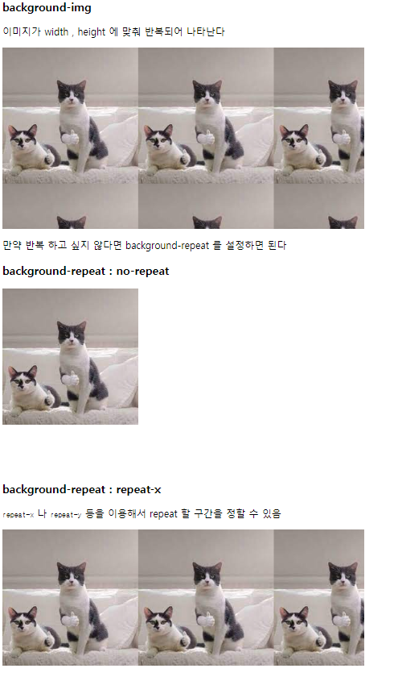
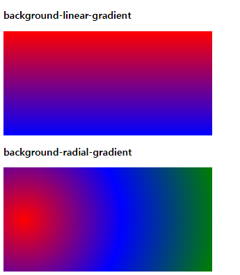

# background-color

# 배경 이미지 스타일

`bacground-color`
HTML 요소의 배경 색을 지정한다.

`키워드` , `16진수` , `RGB` , `특별 키워드` , `전역 값` 으로 설정 가능

### `색상 설정`

```html
    <style>
      .red {
        background-color: red;
        width: 120px;
        height: 120px;
      }
    </style>
  </head>
  <body>
    <h3>background-color</h3>
    <div class="red"></div>
```

### `background-image` 및 `background-repeat`



```css
.image {
  background-image: url(/asset/cat1.jpg);
  width: 600px;
  height: 300px;
}
.image-norepeat {
  background-image: url(/asset/cat1.jpg);
  background-repeat: no-repeat;
  width: 600px;
  height: 300px;
}
.image-norepeat-x {
  background-image: url(/asset/cat1.jpg);
  background-repeat: repeat-x;
  width: 600px;
  height: 300px;
}
```

- 특히 `repeat-x` , `repeat-y` 의 경우 `div` 의 `width , height` 영역은 유지하면서 이미지를 반복할 구간만 정해준다.

### `background-attachment`

`div` 태그 안에 배경 이미지가 있고 컨텐츠가 `div` 태그보다 넘쳐 `overflow : scroll` 로 설정된 경우 유용

- `background-attachment : scroll` : `div` 태그 내에 `background-image` 가 고정되어 있지 않고 스크롤 시 같이 이미지가 고정됨

- `background-attachment : fixed` : `div` 태그 내에 `background-image` 가 고정되어 있지 않고 스크롤 시 같이 이미지가 고정됨

> `scroll` vs `fixed`
> 둘 다 `div` 태그 안에서 이미지가 고정되어 있지 않다는 공통점이 있지만 `view-port` 의 스크롤 상태에 따라 다르게 작동한다.
> `scroll` 의 경우 `view-port`의 스크롤에 따라 이미지의 위치가 변하지만 `fixed`의 경우 이미지의 위치가 `div` 태그 안에서 고정되어 있다.

- `background-attachment : local` : `div` 태그 내에 `background-image` 가 고정되어 스크롤 시 같이 이미지가 내려감

### `background-size`

요소 배경 이미지의 크기를 설정한다.

- `contain` : div 태그 안에서 이미지가 잘리지 않거나 찌그러지지 않는 한도 내에서 제일 크게 설정
- `cover` : 이미지가 찌그러지지 않는 한도 내에서 제일 크게 설정 , 이미지의 가로세로비가 요소와 다르다면 이미지를 세로 또는 가로방향으로 잘라내어 빈공간이 생기지 않도록 설정
  - 현업에서는 `cover` 를 가장 많이 사용하며, 이미지를 배경으로 만들기 때문에 이미지의 position 인 `background-position` 을 같이 설정해줌
- `auto`: 배경 이미지의 원본 크기를 유지
- `length` : 원본 크기의 너비/높이를 주어진 값으로 늘리거나 줄임. 음수는 유효하지 않는다.
- `percentage`: 배경 위치 지정 영역의 지정된 백분율에 해당하는 크기로 이미지를 늘린다.

### `linear-gradient , radial-gradient`



```css
.linear-gradient {
  width: 400px;
  height: 200px;
  background: linear-gradient(red, blue);
}
.radial-gradient {
  width: 400px;
  height: 200px;
  background: radial-gradient(circle at 10% 50%, red, blue, green);
}
```

`background : linear-gradient()` `background : radial-gradient()` 로 그레디언트를 지정 해줄 수 있음

`linear-gradient` 의 경우 `(그레디언트 방향 , [색상 (몇 %) , 색상 (몇 %) 색상 (몇 %) ])` ㄷ등으로 설정 가능

`radial-gradient` 의 경우 `(중심 상하 위치, 좌우 위치 , [색상 (몇 %) , 색상 (몇 %) 색상 (몇 %) ])` 로 설정 가능
