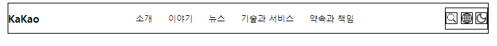
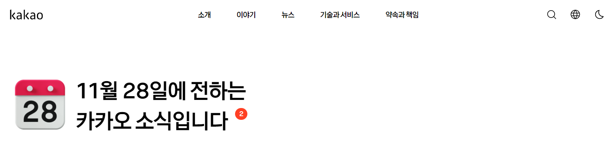

# 카카오 클론코딩

<a href = 'https://www.kakaocorp.com/page/'>카카오 페이지</a>

콘텐츠를 넣기 전에 우선 `layout` 을 크게 크게 잡아보고 시행해보려고 한다.

우선 가장 위에 있는 `nav` 바에 대해서 생각해보자

## Header 영역 살펴보기

가장 상단에 있는 `nav` 영역을 보면

KaKao 란 문구가 카카오 홈페이지로 들어가는 `a` 태그로 구성되어 있고

중간에는 소개 , 이야기 , 뉴스 , 기술과 서비스 , 약속과 책임 이라는 영역으로 다른 곳으로 이동하는 `a` 태그로 감싸져 있다.

맨 우측에는 검색 할 수 있는 돋보기 아이콘 , 언어 아이콘, 다크모드 아이콘이 존재한다.

### Nav bar 만들기

우선 `Header` 태그 안에 `KaKao` , `소개 , 이야기 , 뉴스 , 기술과 서비스 , 약속과 책임` , `Icon` 들이 담길 수 있도록 하였다.

이 때 `Header` 태그와 `div #Wrap-Header` `display` 속성을 `flex` 로 해주어서 Flex 컨테이너로 만들어주었다.

> # `display : flex;`
> 내부의 자식 요소들을 유연하게 배치할 수 있는 레이아웃으로 변경
> - 부모 요소는 `Flex Containor` , 그 부모 태그 안에 있는 자식 요소는 `Flex Item` 이 된다.
> - 자식 요소의 정렬과 배치
>   - `justify-content` 와 `aligne-items` 속성을 사용하여 Flex 컨테이너 내부의 Flex 아이템들을 정렬하고 배치 할 수 있다.

> #`justify-content : space-between`
> Flex 컨테이너 내부의 Flex 아이템들이 Flex 컨테이너의 주축을 따라 고르게 분배하여 띄워주는 CSS 속성이다.
>
> 이 속성을 사용하면 첫 번째 __아이템과 마지막 아이템은 컨테이너 시작, 끝 부분에 정렬되고, 나머지 아이템들은 남은 공간에 고르게 분배__ 된다.

우선 구역 나눈 것을 시각적으로 남겨두기 위해서 `border` 속성은 마지막에 지우도록 하자

실제 카카오 페이지에서는 `ul` 태그를 누르면 밑으로 뿅 하고 세부 내용들이 나오는데 그것은 나중에 자바스크립트를 공부한 다음에 하는걸로 하고 ..

`검색,언어 설정, 다크모드` 아이콘도 누르면 설정이 되는데 그것 또한 자바스크립트를 공부한 다음에 하는걸로 하자

### Title Text

Navigator 밑에는 현재 날짜와 Title Text 가 존재한다. 

날짜 달력의 경우에는 어떤 애니메이션이 가미되어있지만 

그건 내가 못하니까 달력 이미지로 하기로 하고 ><

영역만 구현해놓자 

